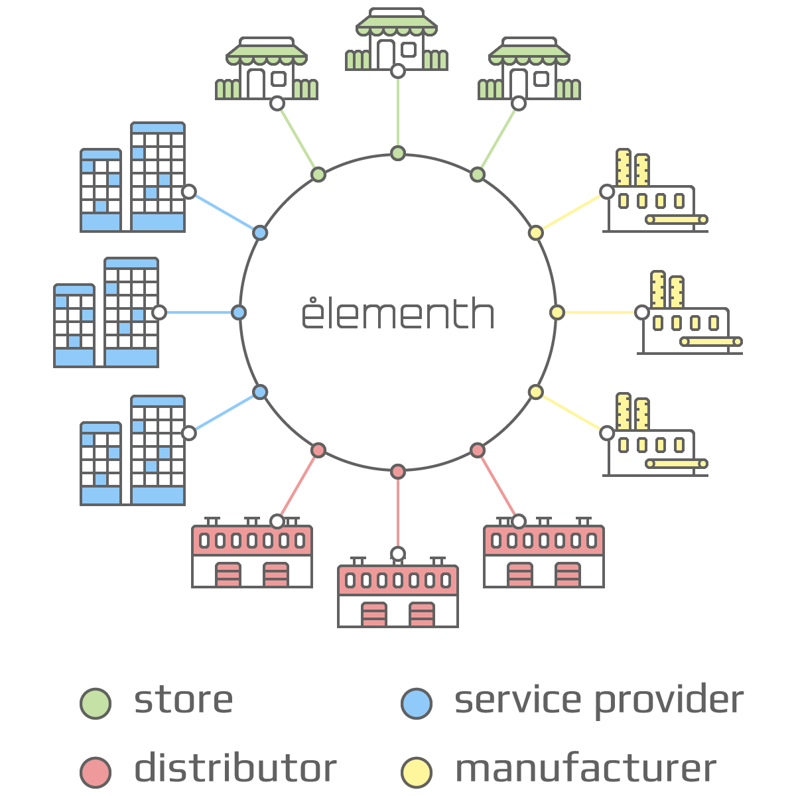
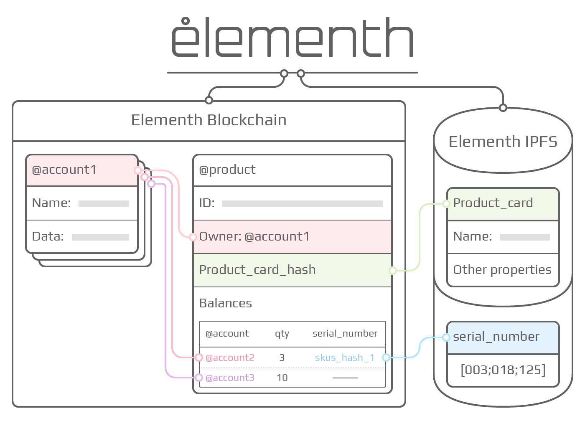

  

## Blockchain for E-commerce

Since 2008, when Bitcoin was created by Satoshi Nakamoto, crypto-currencies and blockchain technology have been increasingly settling down in our world. Limitations of Bitcoin's blockchain resulted in the appearance of a large number of blockchains such as Ethereum [[2]](#references), which allows to create smart contracts in the Turing-complete programming language, EOS [[3]](#references), using the dPoS protocol, increasing the throughput of the blockchain technology hundreds and thousands times. Blockchain technology is coming closer to the real sector of the economy and more and more people are talking about the possible use of blockchain not only in the financial sector.

Elementh has absorbed the best achievements of recent years in the field of blockchain, aiming at solving the problems of the modern world of e-commerce. Elementh is a blockchain for e-commerce, which is a register of ownership of goods with the ability to write specialized smart contracts and use of the nomenclature standard to quickly create various decentralized and centralized applications for e-commerce.

### Content

 * **[Introduction to Bitcoin and Existing Concepts](#introduction-to-bitcoin-and-existing-concepts)**
   - [Background](#background)
   * [Alternative Blockchain Applications](#alternative-blockchain-applications)
 - **[Blockchain and E-commerce](#blockchain-and-e-commerce)**
   * [Decentralized Marketplaces](#decentralized-marketplaces)
   - [E-commerce Issues](#e-commerce-issues)
 * **[Elementh](#elementh)**
   - [System of Goods](#system-of-goods)
   * [Unified Nomenclature of Goods](#unified-nomenclature-of-goods)
   - [The originality of Goods](#the-originality-of-goods)
   * [Accounts](#accounts)
   - [Transactions and messages](#transactions-and-messages)
   * [Blockchain](#blockchain)
   - [DPOS Protocol](#dpos-protocol)
   * [Reward for the Block](#reward-for-the-block)
   - [The System of Tokens](#the-system-of-tokens)
   * [Decentralized Goods Data Storage](#decentralized-goods-data-storage)
   - [Case Study](#case-study)
 * **[Applications](#applications)**
   - [Currency and Issue](#currency-and-issue)
 * **[Conclusion](#conclusion)**
   - [References](#references)

### Introduction to Bitcoin and Existing Concepts

#### Background

The concept of a decentralized digital currency, as well as alternative applications, such as property registers, have existed for several decades. The anonymous electronic money protocols of the 1980s and 1990s mostly depended on a cryptographic primitive known as the Chaumian Blinding [[4]](#references). Chaumian Blinding allowed the creation of new currencies with a high degree of confidentiality, but their main protocols could not be widely spread because of their dependence on a centralized agent. In 1998, b-money by Wei Dai [[5]](#references) was the first proposal to introduce the idea of creating money by solving computational tasks, as well as to offer decentralized consensus, but in this proposal there was little information about how to actually implement it. In 2005, Hal Finney introduced the concept of reusable proofs of work, a system that uses ideas from b-money along with puzzles of the difficulty computable Adam Hackcash Hashcash [[6]](#references) to create a concept of crypto currency, but once again it did not become popular, relying on centralized computing as a backend. In 2009, the decentralized currency was first implemented in practice by Satoshi Nakamoto [[1]](#references), it combined established primitives to confirm ownership through public key cryptography with a consensus algorithm to track who owns the coins, known as "proof of work".

#### Alternative Blockchain Applications

The idea to take the basic blockchain technology and apply it to other concepts also has a long history. In 2005, Nick Szabo proposed a concept of proprietary rights protection with owner authorization [[7]](#references), which describes how "new advances in replicated database technology" will allow the use of a block-based system to store the registry of someone who owns some land, creating a complex structure that includes concepts such as a manor, unfavorable possession and land tax. Unfortunately, at that time there was no effective replicated database system, so the protocol was not actually implemented in practice. However, after 2009, as soon as Bitcoin's decentralized consensus was developed, a number of alternative applications quickly emerged.

Disadvantages of Bitcoin's smart contracts, first of all, the absence of the Turing-complete programming language, led to the appearance of the Ethereum blockchain, a specialized blockchain that allows to write Turing-complete smart contracts. Ethereum plans to switch to the PoS protocol in the future, but currently it is still working on the PoW protocol, which affects the speed and cost of transactions in the system. A promising alternative will be the EOS blockchain, which is currently being developed. It provides the ability to write smart contracts, works on the dPoS protocol and makes it easy to create various decentralized dApps applications based on its own blockchain.

### Blockchain and E-commerce

Since the advent of blocking technology, many people have been trying to link it to commerce, mainly in two formats: the creation of decentralized marketplaces, such as OpenBazaar, Syscoin, Particl, etc .; and payment systems using crypto-currencies in stores, such as Monetha, TenX, Plutus, and others. While the second group, basically, makes a replacement for PayPal and rather refers to the financial sector, decentralized marketplaces try to combine blockchain and e-commerce.

#### Decentralized Marketplaces

OpenBazaar was founded in 2014 and at the moment you can find 1259 products there. It works on the Bitcoin basis using IPFS for data storage.

Syscoin is being currently tested and is based on Bitcoin too.

Particl is still being developed and at the moment it's just a wallet for storing and transferring their tokens.

All existing decentralized marketplaces inherit the shortcomings of the usual online stores and online marketplaces, i.e. lack of a standard of nomenclature, lack of information on different product in a single card and of guarantees that the seller does have the goods presented on the online storefront.

It is important to note that all decentralized marketplaces are not potential competitors, but partners of Elementh blockchain.

#### E-commerce Issues

Historically, the EAN / UPC code is most commonly used in commerce [[8]](#references). Originally, the American UPC system was developed, containing 12 digits for the encoding goods and it gained such popularity that European countries focused on it. However, the entire range of codes was already involved in encoding goods of the USA and Canada while the goods and firms were exclusively registered in the USA. The developers of the European encoding EAN-13 faced a serious task - to extend the range of codes and organize an independent US registration system ensuring maximum compatibility with UPC encoding. The solution was to add the thirteenth digit to the leftmost position (it is usually indicated by the Arabic digit to the left of the barcode) using 12 digital templates like in the UPC. At the same time, it was possible to maintain the backward compatibility of EAN-13 with the UPC coding - the latter became a subset of the EAN-13 coding with the first 0 digit.

UPC codes were standardized and registered by the UCC (Uniform Code Council, Inc.) in the United States and the Electronic Commerce Council of Canada (ECCC) in Canada. In 2005, these organizations merged with the European Association of EAN and formed the global standardization organization GS1 [[9]](#references).

This code was primarily created to automate the trade of goods produced by a great number of enterprises, so the issue of internal content was also important for standardization and regulation in order that different enterprises could not assign the same code to the product. Each newly produced type of goods was supposed to have its own unique code, and this was the main idea of the entire system. That means that if, for example, a manufacturer produces jeans, then jeans of different colors, sizes, cuts, should have different codes. Thus, if we have, for example, 10 colors, 50 models, 20 sizes, then we need 10,000 codes to encode them.

In its turn, same goods by different manufacturers, also had to have a different coding. All this was important for the automation of accounting in trade, automatic control of stock balances in warehouses, store shelves and so on.
The theoretical maximum of the GS1 code is 100 billion different types of goods (11 digits). It would seem like a huge number, but theory does not always correspond to practice, and the current situation shows that during more than 30 years of the system's existence these codes have not been sufficient. This is due to their unbalanced and wasteful spending.
Initially, 11 digits of code were distributed as follows:
1. digit for the prefix;
2. digits for the manufacturer's code;
3. digits for the item of goods code.

That means that theoretically the system implied up to six hundred thousand enterprises (one hundred thousand per prefix), each being able to code up to one hundred thousand items of goods produced by it.

Thus, to date, situations where different goods can have the same barcodes or the same item can have different barcodes are not uncommon. The situation is being made even worse by the fact that retailers often simply print their own barcodes for a variety of goods sold by weight, thereby completely destroying the whole meaning of unique bar codes.

In addition, one should understand that a barcode identifies a product, not a specific SKU (Stock Keeping Unit). To understand the latter additional parameters such as serial number, excise and other types of unique identification of a specific SKU are needed.

Finally, barcodes are often not entered in the ERP system of wholesale companies, and each participant in the sales chain uses his own unique articles for different types of goods.

### Elementh

  

Elementh's goal is to create an alternative protocol for the development of decentralized applications used by e-commerce, providing a standard quality nomenclature, guaranteeing ownership of a particular product and the ability to create specialized smart contracts for e-commerce. Elementh will achieve this by creating a blockchain with a built-in Turing-complete programming language, allowing everyone to write smart contracts and decentralized applications, enabling the use of unified product cards, e-commerce transactions and the transfer of ownership.
 
 
 
 
#### System of Goods

  

Along with the system of tokens, Elementh has a system of goods, which can also be used in a large number of applications, such as tracking the movement of a particular item from its creation to the current owner, tracking original goods and detecting counterfeit goods. Unlike the system of tokens, the system of goods also provides for the ability to "issue" a particular product at a particular address, indicating all possible item's data (such as name, manufacturer, bar code, etc.). And if identical goods are already present in the blockchain, the issuer will receive a message about it, and he will have the opportunity to indicate how many items of goods he wants to "issue".
 
If an item has a serial number, it is possible to specify it when the transfer operation is being performed. To provide protection against data forging, only the hash of the serial number is fixed in the system, therefore only the person who knows the initial number has the ability to make a valid transaction.
In the absence of a serial number at the moment of "issuing" goods, the system generates it randomly and the holder is able to use it to identify a particular item of goods by printing out the QR code on the package, writing it in an RFID tag or in any other convenient way.

#### Unified Nomenclature of Goods

Each supplier / distributor / seller in the world has its own data format for goods, and, more importantly, its own nomenclature. Their number is huge and growing every day. For example, let's have a look at the search output in google.shopping for "iphone 7 256gb red":

   
  

As you can see, each store has a different name for the product, while the search results also present another iPhone model, followed by the iPhone 7 256gb of other colors and so on. An obvious solution to this problem is the creation of a unified nomenclature of goods that will allow users to see offers on the product of interest on one merchandise card and stores to choose suppliers that are most beneficial to them.

One of the key features of Elementh is the availability of a unified nomenclature. To ensure that the merchandise cards are as complete and accurate as possible, and to reduce the likelihood of creating duplicate cards, the cost of creating and using the card will be different. To create a merchandise card a participant will have to pay, for example, 1 EEE (the price will be set by voting of delegates). At the moment when the owner adds the item to the system, he is offered to use an existing card or create a new one. The use of an existing card costs 100 times less than the creation of a new one (for example, 0,01 EEE). The cardholder receives a reward for each owner of goods that uses his card, as well as for making a transaction using this card. Any participant in the system can supplement information in existing cards, and the cardholder can accept or reject the proposed changes.
 

#### The originality of Goods

Goods in the system exist in a single copy and if an item with the same serial number is added to the system, any dApp can notify the buyer that the origin of the goods is unknown. If the chain of ownership comes from the manufacturer, the confirmation of the originality of the goods will be throughout the entire network.

#### Accounts

Account is one of the basic objects in Elementh, it is used as identity of participants of the network. Each account has:
 * account balance of the internal cryptocurrency EEE;
 * information about ownership of goods.

All transactions in the blockchain is made by accounts.

#### Transactions and messages

Any action in the Elementh blockchain is called transaction. The most simple transactions is a transfer of EEE value between accounts and a define ownership for goods. Transaction can include structured message for receiver. Accounts may define scripts to handle messages when they are received. The combination of messages and automated scripts is a smart contract subsystem in Elementh.

#### Blockchain

Transactions in the chain of blocks must be safe, unambiguous and irreversible, and be carried out as quickly as possible to facilitate the reliability and decentralization of the system. In practice, the difficulties arise in two different aspects of this process: selecting a unique node for the production of the block and making the record irreversible.

#### DPOS Protocol

According to the concept of decentralized autonomous DAC companies, decentralization means that each shareholder has an influence proportional to the number of his shares and that the decision taken by voting of 51% of shareholders is irreversible and mandatory. The challenge is how to achieve 51% of the approving threshold in a timely and efficient manner.

To achieve this goal, each shareholder can delegate his right to vote to a delegate. 100 delegate with the largest number of votes delegated generate blocks according to a certain schedule. Each delegate is allocated a time frame for the production of the block. If he does not produce a block, then their turn is skipped, and the next delegate produces a block according to the list. All delegates receive a payment equal to 10% of the average size of the transaction commission. If the middle block contains a fee of 100 shares, the delegate will receive 1 share as payment.

It is possible that a delay in the network can lead to the fact that some delegates will not be able to generate their block in a timely manner, and this will lead to a split of the chain of blocks. However, in practice this is unlikely to happen, because a delegate can establish direct connections with other delegates preceding and following him in the chain. With this model, new blocks can be generated every 10-30 seconds and under normal network conditions, the splits of the chain of blocks are unlikely or can be corrected within a few minutes.

#### Reward for the Block

The blockchain that will use the Elementh software will be awarded with new tokens of the block manufacturer every time the unit is created. The Elementh software can be configured in such a way as to ensure that payment of the block manufacturers is restricted so that the total annual increase in the number of tokens does not exceed 5%.

#### The System of Tokens

The system of tokens can be used in a huge number of applications from binding to assets such as USD or gold to company shares. The system of tokens is easy to implement in the Elementh blockchain. In order to better understand what a token system is, you can imagine a database with only one operation: take X units from A and transfer them to B, under the following conditions, 1) A has at least X units before the transaction is made and 2) the transaction is confirmed by A. What is necessary to implement this system is the implementation of a smart contract with the above logic.

#### Decentralized Goods Data Storage

To store goods data, such as specifications, photos, EAN codes, serial numbers, and others, Elementh uses the IPFS protocol.
IPFS (the InterPlanetary File System) is a content-addressable, peer-to-peer, hypermedia communication protocol. IPFS allows you to create fully distributed applications. It is aimed at making the World Wide Web faster, safer, and more open.
 
IPFS is a peer-to-peer distributed file system that connects all computing devices to a single file system. In a sense IPFS is similar to the World Wide Web. IPFS can be represented as a single bittorrent-swarm, which exchanges files of a single Git-repository [[10]](#references).
IPFS is becoming a new important subsystem of the World Wide Web. Constructed correctly, it is able to complement or completely replace HTTP. It can also supplement or replace other systems.

#### Case Study

Jack, the owner of a small store, was told about the Elementh blockchain and the opportunities it provides. Jack had not sold anything on the Internet before. Having learned about the new possibilities, he decided that it was time to try selling their shoes via the Elementh blockchain, using special applications for sellers. Setting up a store turned out to be quite simple and took several minutes.

  

Having connected his accounting program to the application, Jack managed to recognize stock balance and bind it to a single nomenclature with fine merchandise cards and complete data of the product features. Information about Jack's goods immediately became available to all members of the Elementh network. Steve saw the store with the boots he needed, immediately made the order, and Jack received a notification that Steve wanted to buy his shoes. Customer's money is immediately transferred to a smart contract, which means that the order is real. Having arranged the delivery of the goods to Steve, Jack began his usual work in the store. As soon as the goods were delivered, the money transferred to Jack's account, which means that he didn't have to wait for a long time and immediately invest the profit in a new product.

One day Jack decided to expand the product range and to sell branded bags, along with footwear. Without hesitation, he opened the b2b application for finding suppliers and manufacturers working in the Elementh blockchain and found the bag manufacturer LOUIS VUITTON. He placed the order, transferring crypto currency to the smart contract. The supplier, having received information about Jack's order, immediately formed a dispatch and transferred data on serial numbers to the smart contract. Now that the transaction is underway, everyone will be able to verify that Jack has authentic LOUIS VUITTON bags in his store and not a fake. This is because in the Elementh network each manufacturer can track the movement of goods and if several owners of the same serial number of one product appear, it means counterfeit and its origin is very easy to track and take necessary measures to notify customers about its existence.

Steve has long been using applications for finding the lowest price for the product he needs. Today he decided that it was time to order new shoes and just in a few minutes he found the couple he needed in Jack's store and placed the order, sending money to the smart contract. Steve has not been afraid to make purchases online and send money to unknown sellers for a long time. If Steve does not receive the goods, he will simply indicate it in a smart contract and the money will return to him. This time his order was processed almost instantly and the courier arrived an hour later. Making sure that the shoes are of the right quality Steve completed the smart contract and the money went to Jack while Steve became the owner of a new pair of shoes. He can easily sell this pair of shoes in the secondary market as soon as he gets bored with them because Elementh network knows that he has authentic items not counterfeit ones. Just in two clicks he will be able to put them up for sale.

### Applications

In general, there are two types of applications built on top of Elementh. The first category is financial applications that provide users with great opportunities to manage and participate in contracts using cash, including buying and selling products and content online and offline, as well as tokens built on the Elementh software. The second category is non-financial applications, such as identifying fake / counterfeit goods in the supply chain, etc.
 
1. **Decentralized marketplaces based on Elementh**. Based on Elementh's blockchain any marketplace will be able to allow sellers to use existing merchandise cards without creating new ones. Data on the ownership of the product will allow you to get rid of counterfeit products sold through the marketplace. Unified merchandise cards will allow you to easily find the lowest price for any products. At the same time, it becomes possible to pay using any crypto currency.
2. **Tracking the movement of goods**. The complete producer - distributor - seller - buyer chain, stored in the Elementh blockchain, will allow to find suppliers for any volume of products, up to direct order of goods from the manufacturer. We see it as the future of e-commerce.
3. **Search for goods by geolocation**. Seller information available in the Elementh blockchain allows you to find the most convenient places of purchase for any item.
4. **Decentralized sending of messages**. The ability to send messages allows you to contact directly with any participant in the transaction. This will allow setting up exchange systems, bidding, obtaining individual purchase conditions and so on.
5. **Store designer**. Having all the necessary data to set up a store, the system allows you to create individual decentralized showcases for any vendor in the system.
6. **Fakes search**. Data on all participants of the chain will allow to track the appearance of counterfeit products at any stage of the transfer of ownership of goods.
7. **Banking scoring**. Access to data on all transactions of any participant of the system will allow instantaneous scoring of the seller, which makes it possible to build credit and overdraft systems by the banking institutions.
8. **Different verticals**. Elementh blockchain can be used by any service provider, for example, hotels or airlines with ticket, coupon or voucher entity to store information and track ownership.
 
#### Currency and Issue

Elementh blockchain has its own built-in currency, elementh (EEE), which serves two purposes, firstly, it is to provide a primary level of liquidity, which in turn ensures an efficient exchange between different types of digital assets, and, secondly, more importantly, for payment of transaction fees.

Token and ICO information: EEE, ERC-20 standard 
Total supply: 303 000 000 EEE 
Token distribution: 
217 500 000 (71,78%) EEE - investors 
45 000 000 (14,85%) EEE - team 
40 500 000 (13,37%) EEE - partners and advisors 
 
Private Pre-Sale start date: 15 January 2018 00:00 UTC 
Private Pre-Sale end date: 31 January 2018 23:59 UTC 
Private Pre-Sale soft cap: - 
Private Pre-Sale hard cap: 1 500 ETH 
Private Pre-Sale price: 1 EEE = 0.0001 ETH 
Private Pre-Sale bonuses scheme: 50% Tokens 
 
Pre-ICO start date: 1 February 2018 00:00 UTC 
Pre-ICO end date: 14 February 2018 23:59 UTC 
Pre-ICO soft cap: - 
Pre-ICO hard cap: 1 500 ETH minus received in Private Pre-Sale stage 
Pre-ICO price: 1 EEE = 0.0001 ETH 
Pre-ICO bonus scheme: 1st day: 30% Tokens,  2nd day: 15% Tokens 
 
ICO start date: 1 March 2018 00:00 UTC 
ICO end date: 31 March 2018 23:59 UTC 
ICO soft cap: 10 000 ETH 
ICO hard cap: 30 000 ETH 
ICO price: 1 EEE = 0.0002 ETH 
ICO bonus scheme: 1st day: 30% Tokens,  2nd day: 15% Tokens 

### Conclusion

The Elementh protocol was originally conceived as an enhanced version of the crypto currency, providing advanced functions for e-commerce such as ownership of the product, financial contracts, etc. The Elementh protocol will not support any of the applications directly, but the presence of the Turing-complete programming language means that theoretically arbitrary contracts can be created for any type of transactions and applications. Even more interesting is that Elementh protocol has gone much further than the usual crypto-currency. The protocol that can be used to create decentralized marketplaces, identify counterfeit products, and much more, has a huge potential to significantly improve the efficiency of the e-commerce industry and can give a huge boost to the development of other peer-to-peer protocols by adding the first economic layer.

The concept of an arbitrary state transition function, as well as the ownership of goods, implemented in the Elementh protocol, gives the platform a unique potential. Instead of being a closed, purpose-oriented protocol for a specific set of applications in the field of data storage, gambling or finance, Elementh is an open general-purpose protocol. We strongly believe that it is very well suited for use as a base layer for a very large number of financial and non-financial protocols in the nearest future.
 
 
### References

1. Nakamoto, S. 31 October 2008. "Bitcoin: A Peer-to-Peer Electronic Cash System". Also known as the Bitcoin whitepaper. http://nakamotoinstitute.org/bitcoin/. http://bitcoin.org/bitcoin.pdf. https://github.com/saivann/bitcoinwhitepaper.
2. Buterin, V. 01 September 2014. Ethereum whitepaper. https://github.com/ethereum/wiki/wiki/White-Paper.
3. Larimer D. 06 June 2017. EOS.io whitepaper. https://github.com/EOSIO/Documentation.
4. "Blind signature". Last modified 29 March 2017. Wikipedia. https://en.wikipedia.org/wiki/Blind_signature.
5. Dai, W. U.d. "B-money". http://www.weidai.com/bmoney.txt.
6. Back, A. U.d. Hashcash. http://www.hashcash.org/.
7. Szabo, N. 1998. "Secure property titles with owner authority". http://szabo.best.vwh.net/securetitle.html. Unable to access 20 September 2017. Alternative link here: http://nakamotoinstitute.org/secure-property-titles/.
8. "Universal Product Code". Last modified 02 November 2016. Wikipedia. https://ru.wikipedia.org/wiki/Universal_Product_Code.
9. "GS1". Last modified 26 March 2015. Wikipedia. https://ru.wikipedia.org/wiki/GS1 .
10. InterPlanetary File System - https://en.wikipedia.org/wiki/InterPlanetary_File_System

**Disclaimer:** This draft of the Elementh technical white paper is published solely for information purposes. Elementh does not guarantee the accuracy or conclusions made in this document, and this document is provided "as is". Elementh does not guarantee the accuracy of the conclusions made in this paper, issues it "as is", without warranties of completeness of coverage and explicit or implicit guarantee of the conditions listed (but not limited to): (i) commercial suitability, possibility of specific use, naming or non-compliance rights); (ii) the absence of errors in the text, the possibility of using for a specific purpose; and (iii) non-infringement of rights of third parties by the contents of this paper . Elementh and any affiliated entities waive any liabilities and possible damages that may arise from the use, mention or reliance on the information contained in this paper, as well as any advice on the possibility of such consequences. In no event shall Elementh or its affiliates be liable to any persons or organizations for any damage, loss, liability, cost or expense of any kind, whether direct or indirect, consequential, compensatory, incidental, factual, exemplary, or the costs incurred due to justification or work planning on the basis of this white paper or any content of this document, including without limitation, any loss of business, income, profit, data, accessibility, goodwill or other intangible losses.
