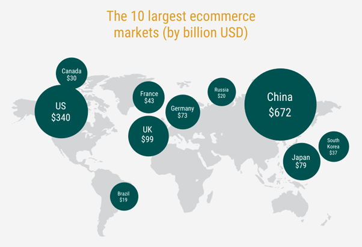

  

## Introduction

Steve Jobs once said: “Great things in business are never done by one person. They’re done by a team of people”. And we totally agree.

Our team’s story began five years ago when Russian enthusiasts Sergey Ryabov (Elementh CEO) and Dmitriy Bereznitskiy (Elementh CTO) undertook one of the biggest challenges in the market: arranging to work with wholesale suppliers.

In 2012 they set up a number of online shops and found out that all suppliers sent their price lists in .xls format, with thousands of names of the same goods. Then they were faced with the nightmare of comparing the same items for days on end. Drawing on their significant experience in development, Sergey and Dmitriy decided to break this mould. Using machine learning algorithms, they solved the problem of matching price lists of various companies.

A year later, in 2013, the shops were sold to a partner. This allowed our team to concentrate on the development of new B2B project Miiix [[1]](#references), and we achieved a new goal: the creation of a unified product classification that would become standard across the e-commerce market.

In 2017, the Miiix [[1]](#references) project accepted SAP Hybris’ offer of partnership. Our product matching system is built on machine learning algorithms and has united over 200 enterprises and SMB clients. Have you heard of Sberbank-AST or Ulmart? We are proud to count them amongst our clients. When the company’s annual turnover exceeded $500,000, we were sure that it was time to enter the global market.

Therefore, in 2018, the company was rebranded from Miiix [[1]](#references) to Elementh. Our team believed that the establishment of a non-profit foundation with access to a global system of product classification, based on the blockchain technology of storing the entire sales chain and the ability to create any centralized and decentralized applications upon the Elementh blockchain, would change the world of e-commerce.

The company’s mission remains unchanged: **to make the e-commerce world better and simpler. To create a standard system, available for use by the entire e-commerce market in both B2C and B2B sectors. To combine all prices for all goods in one place. To create the unified product classification standard and a platform allowing for quick setup and scaling of e-commerce projects.**

### Table of Contents

* **[Introduction](#introduction)**
  - [Table of Contents](#table-of-contents)
* **[Concept](#concept)**
  - [Blockchain and E-commerce](#blockchain-and-e-commerce)
  * [E-commerce Challenges](#e-commerce-challenges)
  - [Elementh Solution](#elementh-solution)
  * [Vision of Transparency as the Future of E-Commerce](#vision-of-transparency-as-the-future-of-e-commerce)
* **[Technical Structure](#technical-structure)**
  - [Unique Identifier](#unique-identifier)
  * [Digital Ownership on Blockchain](#digital-ownership-on-blockchain)
  - [Protocol](#protocol)
  * [System of Goods and Unique Identifier](#system-of-goods-and-unique-identifier)
  - [Matching](#matching)
    - [Introduction to the product matching problem](#introduction-to-the-product-matching-problem)
    * [Machine learning and artificial intelligence to the rescue](#machine-learning-and-artificial-intelligence-to-the-rescue)
    - [Decision](#decision)
  * [Roadmap](#roadmap)
* **[Case Study](#case-study)**
* **[Applications](#applications)**
  - [Token](#token)
  * [Elementh Foundation Economy](#elementh-foundation-economy)
    - [Sources of Funding](#sources-of-funding)
    * [Fund Budgeting](#fund-budgeting)
    - [Future Development](#future-development)
* **[Market](#market)**
* **[Competitors](#competitors)**
* **[Customers and partners](#customers-and-partners)**
* **[The Team](#the-team)**
* **[The Advisors](#the-advisors)**
* **[References](#references)**
* **[Legal Notice](#legal-notice)**

## Concept

Since Satoshi Nakamoto created Bitcoin in 2008, crypto-currencies and blockchain technology have become more and more a part of everyday life. The various limitations of Bitcoin's blockchain resulted in the emergence of a large number of blockchains. One of these was Ethereum [[2]](#references), which enables smart contracts to be created in the Turing-complete programming language, EOS [[3]](#references), which uses dPoS protocol to increase the throughput of the blockchain technology thousands of times over. Blockchain technology is coming closer to the real sector of the economy, with an ever-growing number of people talking about the potential for blockchain to be used in sectors other than financial.

Nowadays, Blockchain is not an enigmatic, technical term for many people but rather a technology that has become a part of our everyday life. There are myriad new projects and ideas appearing, among them imaginary models and directions applicable for blockchain. In late 2017, blockchain began to attract many ambitious people to the industry.

Blockchain has been widely accepted as a new powerful technology. It is believed to have the potential to change the world in the way that the Internet did. Besides that, with the resources of human technology, blockchain development will undoubtedly be accelerated very quickly within a short time period. Significant breakthroughs and continuous expansion will characterize the blockchain sphere in the near future.

The reality, however, is more complicated than it seems. Developments of the blockchain industry can be applied in either financial or non-financial fields. Regarding financial applications, it is obvious that the highest priority is given to compliance, and, at the same time, it is a real challenge to make something totally new. For non-financial applications, there is a range of modes of cooperation, and there is also a powerful drive to move further. It is obvious that there are a number of new solutions based on the blockchain technology which are being developed, but only a few of them have actually been implemented in practice. In this way, it considered a breakthrough when a new project is launched and carried out.

We know that, despite the initial difficulties and challenges, there is always one heroic figure whose persistence and motivation drives them to be the best in their field. To minimize the possibility of failure, Elementh will be shared with potential investors, partners, company customers and associates, since the product is a business that has already been running for five years. Finally, we have developed some well-based ideas and would welcome your participation in the Elementh project.

Elementh has drawn on the best achievements of recent years in the field of blockchain, with the aim of solving problems in the modern e-commerce world. Since we started to collect data on suppliers’ inventory stock and prices six years ago, we have still not gathered 1% of the total number of goods in the world. It is, though, the biggest database of prices in the global scale. From this database, Elementh develops a blockchain for e-commerce, which is an ownership register for goods, with the ability to write specialized smart contracts and use the nomenclature standard to quickly create various decentralized and centralized applications for e-commerce.

### Blockchain and E-commerce

Blockchain technology, despite its prospective viability for the economy, is just at the very beginning of its technological cycle. 
Blockchain has the potential to completely change the entire economic activity. 
The most advantageous feature of blockchain is that it can ensure trust in the Web without centralized management.

Now, economic centralism is the dominating organizing principle when communication and operation costs are high. However, this centralism is gradually changing and there will be far-reaching effects for the society. The emergence of the Internet saw an abrupt fall in communication costs. Blockchain will have the same effect on operating costs. 
Blockchain is an economic infrastructure which enables combination of both physical and digital assets, and to send them to the required recipient, without central management. Blockchain reduces marginal operating costs to almost zero; for example, it is just as easy to sell a house as it is to pay for a blog subscription. Blockchain provides a scalable business model for all Internet users. 
Thanks to new technology, people can conduct business without intermediaries. For example, when working with Uber, Airbnb or eBay, blockchain services allow users to work with the resources collectively, exchange them or operate directly. All of this points towards the beginning of the era of the real “share economy”, which is also called as “the joint participation economy”.

In recent times, blockchain has played an increasingly significant role in various spheres of our lives, and e-commerce is not an exception. Blockchain projects related to logistics of goods, different payment methods on the Internet and decentralized marketplaces are appearing in great numbers on the markets. These projects have great advantages over the existing traditional businesses, namely: transboundariness, trust-free basis, decentralization, low costs, transaction speed, etc.

As of today, the main participants of e-commerce are:
 * marketplaces;
 * online stores;
 * suppliers;
 * market research companies;
 * customers;
 * manufacturers;
 * distributors;
 * payment services.

### E-commerce Challenges

The main goal of e-commerce is to simplify the entire process of buying and selling goods and services and to make this process as transparent as possible at a low-cost. However, the existing technologies do not fully meet these objectives. 
For the moment, e-commerce has a number of sticking points that are significantly impacting its efficiency. 
1. One of the most important obstacles is the non-transparency of information and the complexity in obtaining it. The sheer number of e-commerce participants (brand, manufacturer, distributed retailer, delivery, consumer and regulator) creates the necessity for constant data exchange. In addition, different participants of this market commonly require different parts of the data. That is why, in processing this information, it is always necessary to do the same work many times, which leads to high processing costs, data duplication and loss or partial change of this data. It allows harmful participants of the market to carry out fraudulent schemes, such as fakes, counterfeit, evasion of taxes, illegal import/export, etc.
2. Lack of a unified standard. E-commerce market was formed arbitrarily. The more it grew, the more traditional companies were engaged in online trade. Unfortunately, lack of unified regulations and standards led to chaos in offering products on the market. The same goods in Internet shops, even within one country, have different names and categories. It causes difficulties not only for the final customers, who need to spend considerable time comparing offers from various Internet shops, but for B2B sector as well. Retailers examine offers from various suppliers with a fine-toothed comb in order to find the best deal. It is so due to different formats of data on stock and goods. Marketplaces invent high priced solutions to match goods from the supplier whose data they collect. In such cases, these solutions are a serious restraint for connection to the marketplace.

### Elementh Solution

One of Elementh’s main objectives is to implement the blockchain technology into e-commerce. In setting this kind of objective, Elementh aims to fully utilize the advantages of the technology and make e-commerce as efficient as possible. Step-by-step introduction of the blockchain technology into trade will promote global expansion of Elementh. This combination does not require a drastic change of business processes of the market participants.

We have been actively participating in the e-commerce market since 2007, creating the project Miiix [[1]](#references) in 2012. Its main goal is to standardize nomenclature in the e-commerce market. For six years, we have been helping online retailers to compare millions of goods from thousands of suppliers. Owing to our algorithms based on the use of machine learning, we can automate hundreds of processes to update real-time supplier stock data. Indeed, we have changed immensely since 2012 as a result of both cooperation and feedback from several thousands of retailers, marketplaces, distributors and manufacturers from different countries.

Elementh is the next level in Miiix [[1]](#references) development. Elementh allows everyone to access real-time stock inventory and price data of the vendors inside the blockchain.

Trust and decentralized nature of the Elementh blockchain gives consumers the opportunity to find the best deal and sellers to conduct business more quickly.

### Vision of Transparency as the Future of E-Commerce

Elementh’s vision is to create a completely transparent, trusted ecosystem for the e-commerce market, which is built on the blockchain principle: self-regulated and easily scalable.

This is how the Elementh team sees the future of the e-commerce market:
 * Unified product classification standard used worldwide with unique codes for each product item.
 * Completely transparent system of market transactions.
 * Each participant of the system can completely trust other participants. Value contributed by each participant leaps into a new quality. At that, high-level service rendered by the participants is of greater importance than possession of exclusive information.
 * All market participants make their own contribution to the system development and receive rewards for this contribution.
 * Blockchain technology works not only as a database, it also becomes the basis of business processes of companies.
 * The whole market is an open transparent database permanently enlarged by an inflow of new participants, with high speed of any transactions inside the system.

Market participants:
 * Enterprises and SMB e-commerce companies. They use the unified product classification standard for business, provide services and products for end users and other companies in the system.
 * Service providers. Enterprise and SMB companies engaged in market service. It includes companies engaged in accounting, law firms facilitating major transactions. Development companies creating interfaces for interaction of retail firms and Elementh blockchain, as well as smart contracts for interaction of all system participants. It also includes logistics companies performing physical delivery of goods between all participants of the system.
 * Elementh masternodes. Companies operating the Elementh blockchain and maintaining the required number of nodes for the security of the entire system.
 * End-user. Each end user of the system can increase system node trust upon actual interaction with all of the participants. Users can also receive rewards for teaching matching algorithms and creating new product cards.
 * Elementh Foundation. It is responsible for development of the blockchain network, R&D, development and complete technical assistance of the system. At the initial stage, the foundation is involved in establishing permanent connection to new system participants, maintenance of nodes and writing of smart contracts for the system participants, as well as required development of interfaces for interaction between all of the system participants.

  

Elementh's goal is to create a unified product classification standard and platform that allows for the quick setup and scaling of e-commerce projects. Elementh will achieve this by creating a blockchain with a built-in Turing-complete programming language. It will allow anyone to write smart contracts and decentralized applications. Also, it will enable the usage of unified product cards, e-commerce transactions and transfer of ownership.

To achieve this goal, Elementh will virtually digitize all goods by creating a product card and unique ID for each product.

## Technical Structure

The entire Elementh structure can be represented by the following scheme:

  

The project is based on several systems providing the framework for the project's future structure. These systems guarantee robustness and operability of the entire platform. The whole structure implements chains of blocks based on needs and requirements. This solution saves a lot of storage space and system resource costs. Besides that, the protocol allows the Elementh network to operate significantly more efficiently while maintaining a desirable level of security.

  

Blockchain basis layer:
1. EIPC, EESN is a system of unique numbers to identify goods and SKU;
2. ESCS(g) is genesis of smart contracts to perform basic operations with data;
3. EAS is an addressing system for delimitation of addressing spaces of various data structures.

Blockchain abstract layer:
1. ESS is a multi-purpose system for data storage with the ability to select a storage location (from direct links to external distributed systems for data storage);
2. EANS is a service to select names for different data structures (wallets, products, etc.);
3. EOTS is a complex of tools to process information on ownership and transfer of property;
4. ESCS(u) are user-created smart contracts to perform operations with data;
5. EPCM are prediction services and metadata to automate categorization and attribute extraction from vendor input data;
6. ESNS is a service to validate and generate unique serial numbers for SKU;
7. EPS is a service to check and validate the structure of a product card.

  

Business basis layer:
1. MasterNodes - masternodes are used to speed up transaction confirmation and IPFS data caching in order to accelerate access to the data;
2. Wallet is an application for carrying out all main operations, including creation of goods, statement and transfer of ownership;
3. Blockchain Explorer is a web tool for searching, browsing and checking all data transactions and blocks of the Elementh blockchain;
4. API is a web application developed on servers of the Elementh Foundation that allows access to all blockchain methods used to create light-clients and dAPPs.

Business abstract layer:
1. EOTS (client) is a complex of methods used to obtain information on SKUs ownership history;
2. dAPPs - with implementation of the Elementh technologies, it becomes possible to create many companion dAPPs. For instance:
    1. Decentralized marketplaces - having used the EPCM technology, EOTS allows for the quick establishment of a marketplace with high-quality data.
    2. Tracking a movement of goods - through EOTS an item can be tracked from its manufacturer to the end user.
    3. Search for goods - the EPCM system uses high-quality data on goods, which is suitable for systems searching goods by different criteria.
    4. Fake searcher - EOTS will establish whether the product is fake or not.
    5. Banking scoring - the availability of transactions will make it possible to calculate the rating of each system user.

For the convenience of use, a user-friendly interface between the Elementh basic layer and business abstract layer is implemented. The core process in the development includes standardization and connection with a business system using different types of data. Besides that, accumulating more standard types by using the application opens new possibilities for many big enterprises that are faced with issues such as using SAP, WMS and salesforce, etc.

This abstract layer is located on the top of the entire system. It provides a standard application process module for various businesses, practical development modules. 
The business abstract layer facilitates and accelerates the delivery and deployment to meet the needs of the final application development.

The Elementh platform is multi-purpose and very convenient to use. For example, it is not necessary for any person developing the business abstract layer to have skills related to blockchain development. Ease of use can therefore persuade more developers and technical service providers to use Elementh as their main tool for creating applications for final customers in blockchain.

It also allows somebody with little knowledge in the field to develop the tools for visualized smart contracts and to build connections with a smart contract by means of services for the needs of a relevant business. Even developers from different industries, or those with no blockchain experience, can deploy and develop a smart contract in order to push the application for the industry.

Product Card Structure (EPS)

The main structure of the product used in Elementh is represented below:

  

EPS system is used when adding data. It validates, corrects and classifies data (using machine learning algorithms). The data is stored in json format and recorded in ESS in order to save its place in the blockchain.

### Unique Identifier

IDs in the Elementh are generated by means of sha256 function. At that, a produced ID is hashed before being recorded into a NFC, QR Code or RFID tag(s), which is used for each product. 
EIPC code is generated according to the formula: sha256(sha256(json)+ownerID+blockNumber)

  

EESN code is generated from EIPC + originalSN

  

In the event that there is no original SN (serial number), ESNS service will generate a unique one for further use in QR-code or other media.

### Digital Ownership on Blockchain

Elementh employs a custom-made Smart Contract that enables digital ownership management (EOTS) based on authorization. Expressed by EESN, ownership of objects is connected to an account with key pairs connected to the public and private keys.

The public key is open, and anyone can see it and get access to it. Through the EANS system, the public key can be given an appropriate name. 
The private key is designed for limited authorization and access, like a password, to objects with the corresponding public keys.

  

### API

  

### Storage + Services (ESS)

  

### Protocol

To ensure that the Elementh blockchain operates quickly, we plan to implement it on DPoS protocol. It will provide the maximum speed of the block confirmation and reduce node loads. At the moment, priority is given to the EOS fork.
Since the Elementh blockchain requires operating with huge quantities of data, sharding will be applied, the nodes will store not the entire database but only a part of it, thus allowing significantly less resource requirements.

### System of Goods and Unique Identifier

Historically, the EAN / UPC code is the most commonly used in commerce [[4]](#references). The original American UPC system contained 12 digits for encoding goods and it gained such popularity that European countries focused on it. However, the entire range of codes was already involved in encoding goods in the USA and Canada while the goods and firms were exclusively registered in the USA. The developers of the European encoding EAN-13 faced a serious task: to extend the range of codes and organize an independent US registration system while simultaneously ensuring maximum compatibility with UPC encoding. The solution was to add a thirteenth digit to the leftmost position (it is usually indicated by the Arabic digit to the left of the barcode) using 12 digital templates like in the UPC. At the same time, it was possible to maintain the backward compatibility of EAN-13 with the UPC coding - the latter became a subset of the EAN-13 coding with the first 0 digit.

UPC codes were standardized and registered by the UCC (Uniform Code Council, Inc.) in the United States and the Electronic Commerce Council of Canada (ECCC) in Canada. In 2005, these organizations merged with the European Association of EAN and formed the global standardization organization GS1 [[5]](#references).

This code was primarily created to automate the trade of goods produced by a great number of enterprises. Therefore, the issue of internal content was also important for standardization and regulation in ensuring that different enterprises could not assign the same code to a product. Each newly produced type of goods was supposed to have its own unique code, and this was the main idea of the entire system. That means that if, for example, a manufacturer produces jeans, then jeans of different colors, sizes, cuts, should have different codes. If we have, for example, 10 colors, 50 models and 20 sizes, then we need 10,000 codes to encode them.

Likewise, the same goods from different manufacturers also had to have different coding. All of this was important for the automation of accounting in trade, the automatic control of stock balances in warehouses, store shelves and so on. The theoretical maximum of the GS1 code is 100 billion different types of goods (11 digits). It may seem like a huge number, but theory does not always correspond to practice and the current situation shows that, during the 30+ years of the system's existence, these codes have not been enough. This is due to their unbalanced and wasteful spending. Initially, 11 digits of code were distributed as follows:
1. digit for the prefix;
2. digits for the manufacturer's code;
3. digits for the item of goods code.

That means that theoretically the system catered for up to 600,000 enterprises (100,000 per prefix), each being able to code up to 100,000 items of goods produced by it.

Thus, to date, cases when different goods share the same barcodes or the same item has different barcodes are not uncommon. The situation is being made even worse by the fact that retailers often simply print their own barcodes for a variety of goods sold by weight, thereby completely destroying the whole meaning of unique barcodes.

In addition, it should be stressed that a barcode identifies a product, not a specific SKU (Stock Keeping Unit). To understand the latter, additional parameters such as serial number, excise and other types of unique identification of a specific SKU are needed.

Finally, barcodes are often not entered in the ERP system of wholesale companies, and each participant in the sales chain uses their own unique articles for different types of goods.

  

Along with the system of tokens, Elementh has a system of goods, which can also be used in a large number of applications, such as tracking a particular item from its creation to the current owner, tracking original goods and detecting counterfeit goods. Unlike the system of tokens, the system of goods also allows the "issuing" of a particular product at a particular address, indicating all possible item's data (such as name, manufacturer, barcode, etc.). And if identical goods are already present in the blockchain, the issuer will receive a message about it, and he will have the opportunity to indicate how many items of goods he wants to "issue".

If an item has a serial number, it is possible to specify it when the transfer operation is being performed. To provide protection against data forging, only a serial number hash is fixed in the system, therefore only the person who knows the initial number, has the ability to make a valid transaction. In the absence of a serial number at the moment of "issuing" goods, the system generates it randomly and the holder is able to use it to identify a particular item of goods by printing out the QR code on the package, writing it in an RFID tag or in any other convenient way.

### Matching

The product matching problem is an issue that many have not heard of but solving it will allow for analysis of the contemporary e-commerce market.
When someone is looking for an item on any online store, he or she does not want to see duplicates of the same product in the search results. When an online store works with suppliers, it wants to know what kind of product it will receive from each of them and where they could find the same product at a cheaper price. There are many similar cases in the e-commerce market.

#### Introduction to the product matching problem

Product matching is a process that identifies whether any given group of products sold in different shops or obtained from different suppliers is one product or different products. Many people might think that every product has a UPC (universal product code), GTIN, MPN or ISBN. However, a professional in the e-commerce industry will tell you that a product very rarely has one of these codes. Even if the product does have one, a certain product offer on a certain online shop/supplier may not have a code. This makes product matching very complicated. Even if a UPC, EAN, GTIN, MPN or ISBN code is available, this data may be incorrect, which can lead to wrongful product grouping. As a result, using only these codes for the solution to the problem is insufficient.
Therefore, the fact is that no data source can be fully trusted. Different shops and different suppliers may have different titles, codes and sets of characteristics for the same products. In some cases this difference may be not especially significant, but in others product names may differ dramatically. Product images may be totally different or even inaccurate and brand names may be written in completely various ways.

#### Machine learning and artificial intelligence to the rescue

At Miiix [[1]](#references) we solve this problem using brand-new machine learning algorithms. Let's consider how we solve this problem with a fast overview.
Here is the data that we can use for matching two products:
 * UPC, GTIN, EAN, MPN, ISBN, barcodes;
 * product classification (class/type of product);
 * title, brand, model;
 * product attributes and their values;
 * images;
 * description;
 * price.

For the first step for each product offer, we use a simple text search to find a group of the most likely candidates to match. 
For the second step, we use a machine learning algorithm to determine whether a pair of two product offers refer to the same product or not. During this process we consider the following features:
 * synonyms, tag groups and text similarity for product classification;
 * a number of equality features (comparison of UPC, GTIN, MPN, ISBN, barcodes);
 * text similarities of the titles, brands, models and descriptions (approximate string matching, fuzzy string matching, cosine similarity of tfidf of n-grams);
 * image similarity using siamese neural network;
 * price comparison.

#### Decision

We have a final classifier which constantly learns and makes a decision about match or mismatch based on historical labeled data. We analyze matches and mismatches flagged by our algorithm on a daily basis and tune a threshold to determine whether a pair of product offers are identical. Every day our algorithm processes a huge number of pairs of products. Nevertheless, we continue to improve our algorithms and metrics, although there remains a lot of work to be done.

### Roadmap

The Elementh’s technology team has three main goals:

1) R&D: priority is given to the bottom level of technology and development, it employs the most advanced technology analysis and experiments. We will draw up plans for development of the next generation of the technology and conduct a feasibility study.                                                                  
2) Development: On the basis of R&D results, we shall carry out development until the initial testing result is obtained.

3) Testing, deployment and maintenance: Having obtained the development result, the R&D team must improve and correct the testing results as well as proceed to relevant deployment and maintenance.

Below is the path of the Elementh’s technology development:

  

## Case Study

Jack, the owner of a small store, was told about the Elementh blockchain and the opportunities it offers. Jack had never sold anything on the Internet before. When he learned about these new possibilities, he decided that it was time to sell his shoes via the Elementh blockchain, using special applications for sellers. Setting up a store turned out to be quite simple and only took several minutes.

  

After connecting his accounting program to the application, it was easier for Jack to determine his stock balance and bind it to the single product classification with fine merchandise cards and complete data on the product features. Information about Jack's goods immediately became available to all members of the Elementh network. Steve saw some boots he needed in the store and immediately ordered them, upon which Jack received a notification that Steve wanted to buy his shoes. Customer's money payment is immediately performed via a smart contract, which means that the order is real. Having arranged the delivery of the goods to Steve, Jack began his usual work in the store. As soon as the goods were delivered, the money was transferred to Jack's account, which means that he didn't have to wait long and could immediately invest the profit in a new product.

One day, Jack decided to expand the product range and sell branded bags, along with footwear. He opened the B2B application for finding suppliers and manufacturers working in the Elementh blockchain immediately and found the bag manufacturer LOUIS VUITTON. He placed the order, transferring cryptocurrency to the smart contract. The supplier, having received information about Jack's order, immediately arranged for the goods to be dispatched and transferred serial number data to the smart contract. Since the transaction was now underway, everyone could verify that Jack has authentic LOUIS VUITTON bags in his store, not fakes. This is because in the Elementh network each manufacturer can track the movement of goods; if several owners of the same serial number of one product appear, this implies counterfeit. It is very easy to track the origin of such products and take necessary measures to notify customers about its existence.

Steve has been using applications for finding the lowest price for the product he needs for a long time. Today he decided that it was time to order new shoes. In just a few minutes he found the pair he needed in Jack's store and placed the order, sending money to the smart contract. Steve has not been afraid to make purchases online and send money to unknown sellers for a long time. If Steve does not receive the goods, he will simply indicate it in a smart contract and his money will be refunded. This time his order was processed almost instantly and the courier arrived an hour later. Once he made sure that the shoes were good quality, Steve completed the smart contract. Jack received his money and Steve became the owner of a new pair of shoes. He can easily sell this pair of shoes in the secondhand market as soon as he gets bored of them because the Elementh network knows that he his goods are authentic, not counterfeit. In just two clicks he will be able to put them up for sale.

## Applications

In general, there are two types of applications built on top of Elementh. The first category is financial applications that provide users with great opportunities to manage and participate in contracts using cash, including buying and selling products and online and offline content, as well as tokens built on the Elementh software. The second category is non-financial applications, such as identifying fake/counterfeit goods in the supply chain, etc.
1. Decentralized marketplaces based on Elementh. Based on Elementh's blockchain any marketplace will be able to allow sellers to use existing merchandise cards without having to create new ones. Ownership data will allow you to get rid of counterfeit products sold on the marketplace. Unified merchandise cards will allow you to easily find the lowest price on any products. At the same time, you can pay using any cryptocurrency.
2. Track movement of goods. The complete producer - distributor - seller - buyer chain, stored in the Elementh blockchain, will allow you to find suppliers for any amount of products, even order goods directly from the manufacturer. We see it as the future of e-commerce.
3. Search for goods by geolocation. Seller information available in the Elementh blockchain allows you to find the most convenient places of purchase for any item.
4. Decentralized sending of messages. The ability to send messages allows you to directly contact anyone involved in the transaction. This will permit the setting up of exchange systems and bidding, obtaining of individual purchase conditions and so on.
5. Store designer. Having all the necessary data to set up a store, the system allows you to create individual decentralized showcases for any vendor in the system.
6. Fakes search. Data on all participants of the chain will allow you to identify counterfeit products at any stage of the transfer of ownership of goods.
7. Banking scoring. Access to the data of anyone on the system (on all transactions) will allow the seller to be instantaneously scored, enabling credit building and overdraft systems by the banking institutions.
8. Different vertical markets. Elementh blockchain can be used by any service provider, such as hotels or airlines that offer tickets, coupons or vouchers to store information and track ownership.

## Establishment of Elementh Foundation

In March 2018, a non-profit enterprise called the Elementh Foundation was established in Singapore. The foundation’s core activity is to support and develop its blockchain in order to provide a transparent and safe environment for global e-commerce.

The decentralized nature of the Elementh blockchain allows everyone in the global e-commerce market to create various applications for their own needs and business processes. It’s an extremely convenient solution for everyone. But, it can also cause slow blockchain development and hard decision making at higher levels, since opinions may be completely different. 
In order to improve this situation, the Elementh combines the decentralized structure of blockchain technology with traditional centralized management practices. This means that serious inconsistencies and imbalance in the blockchain development can be avoided.

### Token

Elementh Token (EEE). Since the Elementh Token is a utility token, it is constantly moving around in the system. More than 70% of tokens (71.78% will be sold via ICO) will belong to the system participants and will continuously move around within the Elementh.

Initial token distribution among companies and end users will be carried out through ICO. The Elementh Foundation will exchange these tokens for ETH or BTC which, in turn, are used for blockchain extension, development, attracting new investors and maintaining the entire system.

The Elementh Foundation receives EEE tokens as a fee from each transaction in the system. From 75% to 99% of the received fee will be paid by the Elementh Foundation to the masternodes for system maintenance. Up to 25% of the fee will be retained by the Elementh Foundation for daily operations, business promotion and technical development.

Service providers pay the fee in the system and receive tokens in turn from companies requiring their service. Any interaction, such as access to the company’s necessary data, will be paid with EEE tokens in the system.

End users can fully or partially pay for products or services from the companies in the system with EEE tokens. Users can be rewarded in tokens for maintaining and developing the system, such as matching algorithm learning or product card creation, as well as detecting fake goods in the system.

### Elementh Foundation Economy

In its economic operations, the Elementh Foundation will keep to the following main principles:
1. Full transparency of operations;
2. Non-profitability as the Foundation’s business process framework;
3. Constant research and development with use of the best practices;
4. Sharing all results of our work.

The Elementh Foundation financial assets consist of the initial funding received during the ICO, the fee from all operations in the Elementh blockchain and digital asset income. The Elementh financial department will mainly aim to manage all financial assets and make financial reports on a monthly basis.

From a financial point of view, the Elementh Foundation will maintain the balance between expansion and community development. Besides the initial funding from the ICO, the Elementh Foundation will be able to get digital asset income through the system internal operations. By means of establishment of the third party trustee, transparency of distribution of income to all operations and community development will be maintained.

The Elementh Foundation will appoint a full-time financial team to manage its financial and digital assets. The financial team will report directly to the Foundation management, and regularly prepare financial reports and disclosures of the Elementh Foundation.

#### Sources of Funding

The main income of the Foundation can be divided into two areas:
1. Non-operating income comprising the initial ICO funds and the return on digital assets.
2. A part of fees for all transactions in the Elementh blockchain will be transferred to the Elementh Foundation and used for project development.

The following is a detailed description of the main sources of income:

a. ICO initial start-up funds.

Token and ICO information: EEE, ERC-20 standard 
Total supply: 303 000 000 EEE 
Token distribution: 
217 500 000 (71,78%) EEE - purchasers 
45 000 000 (14,85%) EEE - team 
40 500 000 (13,37%) EEE - partners and advisors

private pre-sale/pre-ICO round: closed. Collected 910 ETH.

ICO prefund stage start date: 15 February 2018 00:00 UTC 
ICO prefund stage end date: 31 March 2018 22:00 UTC

ICO start date: 1 April 2018 00:00 UTC 
ICO end date: 30 April 2018 23:59 UTC 
ICO soft cap: 10 000 ETH 
ICO hard cap: 30 000 ETH 
ICO price: 1 EEE = 0.0002 ETH 
ICO bonus scheme: 1st day: 30% Tokens, 2nd day: 15% Tokens 
There is no minimum or maximum amount to participate in the ICO stage. 
Tokens will be distributed at the moment of purchase in the ICO stage.
All unsold tokens from ICO stage will be burned.

Details:

The Know Your Customer (KYC) procedure, where contributors disclose their personal information, is mandatory in both phases before taking part. 
At the prefund stage, contributors invest in a smart contract to make a shared pool that will be allocated as soon as the sale of tokens is opened to the public. It is conceived in such a way so that contributors will not miss the presale start on April 1st at 00:00 UTC. In addition, they will receive 30% of the first day bonus.

All tokens will be distributed after the completion of the last phase and will be locked (non-transferable) for the end of tokensale. After successful tokensale all tokens will be unlocked and become transferable.

There are tokens that will have a vesting period according to the following schedule:   
 * Tokens allocated to the team will have a vesting period of six months;
 * Tokens allocated to the advisors will have a vesting period of six months.

#### Fund Budgeting

As we stated before, the Elementh Foundation's funds are predominantly spent on daily operations, technology and business development, and reinvestment. The main investment categories are highlighted in the table below:

Elementh Funds distribution

| Classification | Percentage | Content |
| --- | --- | --- |
| Technology development | 50 | Includes rewards for initial team, recruitment of experts and developers |
| Business development & marketing | 35 | Business development and training, marketing, including advertising campaigns for user acquisition and branding, covering the costs of negotiating partnerships with retailers, distributors and producers. |
| Reinvestment | 10 | Investment of digital assets. In its continuous operation, the Elementh Foundation will invest 5 - 10% of the funds or digital assets in blockchain industry development, such as start-ups and business incubators, angel investment in emerging scientific and technological businesses related to the e-commerce market with further potential to become partners or clients of Elementh. |
| Daily operation | 5 | covering day-to-day operations, office rent, office equipment, travel expenses and legal fees. |

See the foundation’s initial forecast for the next four years of its operations:

#### Future Development

The Elementh goal is to create an infrastructure for e-commerce. On one hand, the infrastructure will accommodate for even the simplest interaction and, in this way, minimize the need to alter the processes of an existing business. On the other, users will be able to fully enjoy the advantages of the new blockchain technology, related to market transparency and minimization of transaction cost. The Elementh Foundation focuses on three main areas in project development, which are necessary to reach a brand-new level of the e-commerce global market.
1. Research and Development. While creating and developing the blockchain, the Elementh team continues to explore all emerging research and developments in the field of blockchain. At the moment, the blockchain technology is one of the most rapidly evolving. Therefore, continuous monitoring and implementation of new abilities (such as atomic transactions, etc.) will allow us to significantly improve our own developments and the system as a whole.
2. Business development. The possibility for users to add data to different parts of the sales chain is one of the advantages of having Elementh as the e-commerce infrastructure. This means that multiple users contribute to the sales process. This fact predetermines one part of development: establishing a wide partnership network, which will happen through registering in Elementh and adding information on a product to our blockchain. Mostly, it relates to the SMB segment. We will also arrange a similar partnership with market major players, including distributors, retail companies and manufacturers. Having already achieved certain agreements with SAP Hybris, who plan to make great use of Elementh data, we are now partnered with the world’s top 500 online retailers.
3. Content. One of Elementh’s main goals is to create a unified standard for e-commerce data. In order to achieve this quickly, we aim to widen the product classification database. We currently have approximately 40,000,000 product cards. We are planning to increase this number up to 100,000,000 over the next two years and translate them into various languages.

## Market

The e-commerce market has been developing for about 25 years. From the very beginning of its existence, it has focused on B2C trading. However, in recent years, creating a B2B e-commerce market has become more and more important.
Elementh has created an infrastructure in which various people in the e-commerce markets, especially those from the B2B segment, can interact with each other. By creating a new standard of e-commerce that has significant advantages (market transparency, transaction cost reduction), we are planning to attract more B2B clients.   

B2B e-commerce (short for business-to-business electronic commerce) is the marketing, selling, and distribution of products or services from one business to another through an online or digital portal.

While B2C (business-to-consumer) e-commerce is expected to hit $2.4 trillion worldwide by the end of 2017… this is still less than a third of B2B’s $7.7 trillion.

In 2017, according to Statista, “the gross merchandise volume of business-to-business e-commerce transactions is projected to amount to 7.66 trillion U.S. dollars, up from 5.83 trillion U.S. dollars in 2013.”

This difference in growth almost matches the entire amount of projected transactions in B2C e-commerce, which was at $2.143 trillion in 2017.

  

  

The Internet is the first place customers turn to when making B2B buying decisions

  

The greatest myth relating to wholesale e-commerce is that it is difficult to get your sales channel up and running. Using Elementh is a fast and convenient way to start selling and give your customers the optimal portal to streamline their ordering process.

**Transparent Ecommerce Pricing Drives Repeat B2B Purchases**

  

Transparency in pricing and product details [[6]](#references) is the number one factor in repeat B2B purchases. Strangely enough, the same study found that “consistently lower prices” is only the fourth most determining factor.

In other words, customers want to know the truth … and they want to know they’re getting the truth more than they’re getting the lowest price. In fact, 85% of buyers want full transparency from merchants, including “all relevant shipping fees, duties, and taxes, so they know what they are paying.”

**More companies are buying online, and B2B sellers are investing in technology.**

B2B e-commerce executives expect strong growth ahead, and they’re investing now to take advantage of that growth.

For example, 46% of business-to-business e-commerce executives surveyed recently by Forrester Research Inc. and Internet Retailer say they expect more than half of their customers to be buying online in three years time. 67% expect their technology budgets to increase this year and 49% say that within 18 months they will upgrade the e-commerce platform they use to sell online to other companies, government agencies and educational institutions, the major B2B buyers.

“That’s pretty aggressive, because it’s going to take a while to do, but they feel a real urgency now,” Forrester analyst Andy Hoar said on a webinar reporting on the results of the survey. The webinar was sponsored by Hybris, a unit of SAP AG that provides e-commerce software.

Hoar also reported the following survey results:

 * 62% of e-commerce executives surveyed said that e-commerce has “fundamentally changed the way customers interact with us.”

 * 69% say they expect to stop printing a catalog within five years. Hoar said catalogs, which have been bedrock marketing tools for many manufacturers and wholesalers for years, may not go away entirely, but they will change, for example, by getting smaller. B2B sellers will also use more interactive online tools to provide information now provided in catalogs.

 * B2B executives mostly think their sites are as good as or better than those of their online B2B competitors – 48% said better and 39% believe they are as good. However, they don’t think their sites compare well to the ease of shopping on Amazon: 48% of respondents said their sites were worse than Amazon in terms of customer experience.

 * Both average order value and conversion rates are trending upwards. 48% said average ticket was going up and 31% believed it is staying the same; 48% said conversion rate was going up, and 32% stated that they believe it is staying the same. The average order value was $491 for B2B respondents versus $147 for consumer-oriented e-commerce executives; the average conversion rate reported by B2B survey respondents was 10%, much higher than the 3% average reported by business-to-consumer executives responding to the survey.

 * B2B executives say about 7% of their online revenue is being spent on technology, including applications, licenses, fees and employees, while the B2C executives said that this came to about 4% of their online revenue. Hoar said that this shows the drive among B2B companies to invest now in e-commerce.

 * Top technology priorities for B2B companies are their e-commerce platforms, cited by 64% of respondents. That was followed by integration with accounting and order management systems, 60%, and mobile sites and apps, 56%.

Elementh’s target market is potentially the entire e-commerce market as the Elementh platform is multipurpose and multifunctional. It will serve as the basis for the worldwide development of centralized and decentralized applications of e-commerce. Elementh will become for e-commerce what Ethereum is for ICOs.

## Competitors

Any B2B company, marketplace or online store in the world can use Elementh Blockchain for product classification. E-commerce is a growing market in all countries, and the popularity of decentralized marketplaces is advantageous to the Elementh Foundation. We are planning to collaborate with all new marketplaces so our blockchain can become the standard for the e-commerce market.

The direct competitors of the project are existing online B2B e-commerce projects, such as Indix. However, the Elementh project is innovative in that it employs blockchain technology and can be used by decentralized marketplaces that use cryptocurrencies for internal payments.

There are also some Blockchain platforms for e-commerce that are competing with Elementh, such as VeChain, INS Ecosystem, Connectius, Flipz, StopTheFakes etc. It should be noted that some of them are niche products and none of them are really infrastructure platforms but rather a kind of application for smart contracts in e-commerce. Elementh is an infrastructure-building project and can be used by different marketplaces and platforms.

Another important advantage of the Elementh team is the significant experience it has gained working both in the B2B e-commerce market since 2012 and with real customers. Different marketplaces can be also considered to be competing with the Elementh project because they can be developed without Elementh, yet still operate in the same market. It is very important for the Elementh team to become partners with all current decentralized marketplaces that are already in existence or soon will be.

The main advantages of Elementh:
1. Saleschain
2. Unified product classification (including product-matching algorithms)
3. Real-time and historical data on stock inventory and price
4. Multi-industry orientation
5. Working business

Elementh provides everyone in the e-commerce market with real-time and historical data on stock inventory and price. It also allows users to create decentralized and centralized applications based on the Elementh blockchain. The decentralized nature of the Elementh blockchain allows customers to find the best deal and vendors to sell quicker.

## Customers and partners

The Elementh project grew out of Miiix [[1]](#references), a product which has been in development since 2012. Miiix [[1]](#references) is a full-fledged business in Russia, in which RSV Venture Partners and business angels have invested. It has formed solid partnerships and can boast more than 200 small and medium online stores and marketplaces as customers.

At the moment, its major clients are Sberbank-AST and Ulmart.

Its biggest partner is SAP Hybris.

We have established a connection to SAP Hybris and Ulmart, so they can our descriptions for goods on their marketplaces. We also discussed the opportunity to promote this solution among other SAP customers worldwide with SAP and SAP Hybris in Russia. In 2018, Elementh is planning to participate in the SAP COIL program to improve our SAP store.

Elementh was previously intended for SMB stores and marketplaces, because their problems seemed easier to understand, but we have now realised that wholesale suppliers and manufacturers are generally not in direct contact with one another because they use different ERP software and their businesses involve lots of manual work.

## The Team

The Elementh Team is made up of 17 members. The three founders, each from a background in e-commerce, have worked together for years have gained a lot of experience in this field. The team’s background is not limited within only Miiix project. There are a developed platform for unsaleable stocks of retailers, as well as some other products.

**[Sergey Ryabov](https://www.linkedin.com/in/sergey-ryabov-20108765/), CEO** 
An entrepreneur and people-oriented professional, Sergey has over 17 years of proven experience in starting and growing businesses. He has shown himself to be successful in marketing and building high-performance executive teams and leading sophisticated platforms and service organizations with market penetration. Sergey is a strategic visionary with a clear sense of purpose and urgency when faced with diverse situational challenges during periods of both declining sales and rapid growth. After he founded Miiix [[1]](#references) in 2012, the company received the Russian Startup Award of the Year 2013. In 2017 the project was integrated with SAP Hybris in order to help product matching in major global marketplaces and retailers. He loves thinking of and implementing improvements, and is always optimistic. He is particularly interested in mixed martial arts :)

**[Dmitriy Bereznitskiy](https://www.linkedin.com/in/bdmitry/), CTO** 
An Evangelist of Agile methodology, Lean Startup and Theory of Constraints, Dmitriy is Miiix’s [[1]](#references) technical director and partner. He has more than 15 years experience in commercial web development, and has devoted 10 years to e-commerce and another 7 to managing development teams. At the same time...Did you know that he helped to bring more customers to Amazon by developing a system of affiliated stores?

**[Vitaliy Mengeshev](https://www.linkedin.com/in/vitalii-mengeshev-aba47a14b/), COO** 
Vitaliy is the Executive Director and Partner for the Miiix [[1]](#references) project. A highly skilled, solution-driven ecommerce catalyst with over 15 years of extensive experience in business development, client relationship management, strategy, revenue optimization, project planning, management and training, conflict resolution and innovation. He is one of the most well-known lecturers in the IdealMachine and Skolkovo startup acceleration programs. He is always looking towards the future and is excited by new technology. His current main interests include bouldering, snowboarding and wakeboarding.

**[Artem Kirillov](https://www.linkedin.com/in/artem-kirillov-72060855/), Blockchain Developer and Architect** 
Artem is a technology developer and blockchain specialist who develops and implements high volume complex global systems in financial services. He is an expert in blockchain, architecture, and automation. Artem is also known for building strong teams, coaching staff on new technology and having a comprehensive understanding of business strategy, which translates into innovative solutions and increased profitability. He is one of the developers of Hitbtc (in top 10 crypto-exchanges) and is in charge of production operations in the largest Russian mining pool. He has over 15 years of IT experience and is a graduate of MBA Bode Graduate School of Business.

**[Aleksandr Vasilev](https://www.linkedin.com/in/aleksandr-vasilev-4bab3425/), Data Scientist** 
Aleksandr is passionate about solving problems with data. He has an impressive amount of experience in developing systems for predictive analytics and data analysis. His outstanding solutions are implemented in areas such as insurance, banking and e-commerce. Aleksandr knows everything about the world’s latest developments in the field of machine learning and artificial intelligence, which is the secret to his incredible ability to match products from various data sources. He’s a great team builder and a master collaborator.

**[Sergey Morozov](https://www.linkedin.com/in/sergey-morozov-aba83b80/), Blockchain Developer** 
Sergey is a blockchain technology geek, a system architect and database administrator of various types, and a professional skilled in building highly efficient systems. His career in development started 10 years ago. During this time he was involved in the development of a large number of systems for data processing: from systems for copywriting work to financial accounting systems. Sergey was one of the leading developers of SAAS service, which has millions of users.

**[Eugene Prigornitskiy](https://www.linkedin.com/in/evgeniy-prigornitskiy-67566077/), Go Developer** 
Eugene has spent 10 happy years working in commercial development and has participated in the development of various payment systems, ERP and mobile applications (iOS, Android, Windows Phone). He also has extensive experience in building highly efficient real-time systems and database development. He is a long-time fan of winter sport, a talented snowboarder and lover of skating.

**[Sergey Miheev](https://www.linkedin.com/in/sergey-mikheev-54168a62/), System Administration** 
Sergey worked as a technical expert on the implementation and support of ERP and databases on large production sites. He started working with crypto-currencies and blockchain in 2016. He has a unique ability to understand any sort of technology very quickly. He is a bit of an intellectual who spends his free time enjoying the ancient GO game.

**[Peter Gashnitsky](https://www.linkedin.com/in/peter-gashitsky-b08553157/), UX/UI Designer** 
Peter is a man of art: experienced web and graphic designer, talented illustrator. His motto is «clean projects, clean design». He talks and draws a lot. Prefers coffee. In his free time, he enjoys designing yachts and illustrating beer labels.

**[Alexander Kholodnykh](https://www.linkedin.com/in/ni-moc-nideknil-www/), Backend Developer** 
Alexander has 9 years of commercial development background. He specialises in web crawling, process automation and server-tasks solving. As a member of the team, he is also responsible for searching spider development and finding information about goods and prices.

## The Advisors

Elementh’s project advisors have huge experience as entrepreneurs and IT-business experts. Having advisors like this will undoubtedly be a boon for the project.

**[Naveen Yannam](https://www.linkedin.com/in/naveen-yannam-1553a91/), Tech advisor and early contributor** 
Naveen is a Certified Hybris 5 Core and Commerce Developer. He has extensive experience in using various frameworks and libraries to implement enterprise class applications. He’s also a keen user of Agile methodologies and has successfully exercised agile techniques into the projects which he was involved. Naveen feels comfortable working as a Hybris Technical Lead, ideally in a project team developing large-scale e-commerce systems with Continuous Integration and Delivery methodologies.

**[Proorocu Aurel George](https://www.linkedin.com/in/aurelp), Marketing advisor** 
In 2016, Aurel was one of Financial Times "100 Faces of Innovation" thanks to his contribution to the development of the Internet market in Romania. He has over 14 years’ experience in the IT and Digital marketing field, working for Companies like Google Enterprise, Orange and Keyence. Aurel is also the youngest graduate of the Executive MBA program of Telecom Ecole de Management Paris (Institut Mines Telecom).

**[Michael Averbach](https://www.linkedin.com/in/michael-averbach-40720b/), Financial advisor** 
Michael is entrepreneur and investor with 20+ years in IT-business,. His key expertise includes creating of business structures, marketing and sales strategies, creating mobile applications and mobile devices, electronic commerce and corporate software, as well as managing software development process. He co-founded Ectaco, Inc., (USA), a leading developer of electronic translators and linguistic solutions, where he managed the sales network, comprised of 13 foreign sales offices and dozens of independent distributors around the world. He also founded MobiDealer, Inc. (USA), where he oversaw the creation of distributed ERP system software package. After the successful launch of the system, the company was sold to a strategic investor. Co-founded DynoPlex, Inc. (USA). He grew the company from the ground up to become one of the largest developers of mobile applications. He successfully sold the company and transitioned to manage offshore development for the purchaser, Quickoffice, Inc. (USA), where he oversaw the work of two offshore centers for mobile application development, totalling 140 engineers. The company was subsequently sold to Google in 2012. After the sale of Quickoffice, he started a venture fund called RSV Venture Partners and served as a managing partner of startup-accelerator iDealMachine, which invests in companies at the very early stage.

**[Sergey Fradkov](https://www.linkedin.com/in/sfradkov/), Legal advisor** 
Sergey Fradkov is an experienced software visionary and investor with extensive technical and business backgrounds. Mr. Fradkov is one of the founders of iDealMachine, an early stage venture fund and startup accelerator that operates in St. Petersburg, Russia, and is currently expanding nationally and internationally. Prior to that, Mr. Fradkov was one of the founders of several high-tech startups. His most recent venture, DynoPlex, was sold to a competitor, Quickoffice, in 2008 and Quickoffice itself was acquired by Google in 2012. Before that, Mr. Fradkov co-founded w-Trade, a pioneering Wireless Applications company, where he raised over $40Mln and built the product that was sold to large financial institutions, such as Merrill Lynch, Fidelity, Morgan Stanley and others. Overall, he has over 25 years of experience developing and designing distributed, wireless and e-commerce systems and managing large product development teams. Mr. Fradkov graduated from Jerusalem University.

## References

1. http://miiix.org/
2. Buterin, V. 01 September 2014. Ethereum whitepaper. https://github.com/ethereum/wiki/wiki/White-Paper.
3. Larimer D. 06 June 2017. EOS.io whitepaper. https://github.com/EOSIO/Documentation.
4. "Universal Product Code". Last modified 02 November 2016. Wikipedia. https://ru.wikipedia.org/wiki/Universal_Product_Code.
5. "GS1". Last modified 26 March 2015. Wikipedia. https://ru.wikipedia.org/wiki/GS1.
6. https://www.hybris.com/medias/sys_master/root/ha4/h37/8809794764830/Forrester-Mastering-Omnichannel-B2B-Customer-Engagement-October-2015-12pg.pdf

## Legal Notice

The purpose of this Whitepaper is to provide an information about Elementh project to potential holders of EEE tokens. The information given herein is not exhaustive and it does not imply any contractual obligations and may be considered only as the marketing information about the project. This Whitepaper is intended to provide basic data on the project to the potential token holders so they can make an informed decision about purchasing EEE tokens. 
Nothing herein may be interpreted as an investment quotation of any kind. This quotation of EEE tokens is not an offer to sell or buy securities in any jurisdiction. This document does not offer purchasing EEE tokens to individuals and companies that do not possess sufficient legal capability for participating in tokensale. 
If you are not sure that you are entitled to participate in tokensale of EEE tokens, you should ask a professional legal, financial, tax or other consultant for advice. 
Participation in tokensale is entirely voluntary. Each participant must carefully review and accept the terms of the token sale agreement on the Elementh token sale project website. If you disagree with the terms partly or fully, you should not participate in tokensale; if you still do participate Elementh will have to decline participation in token sale and in purchasing EEE tokens.

