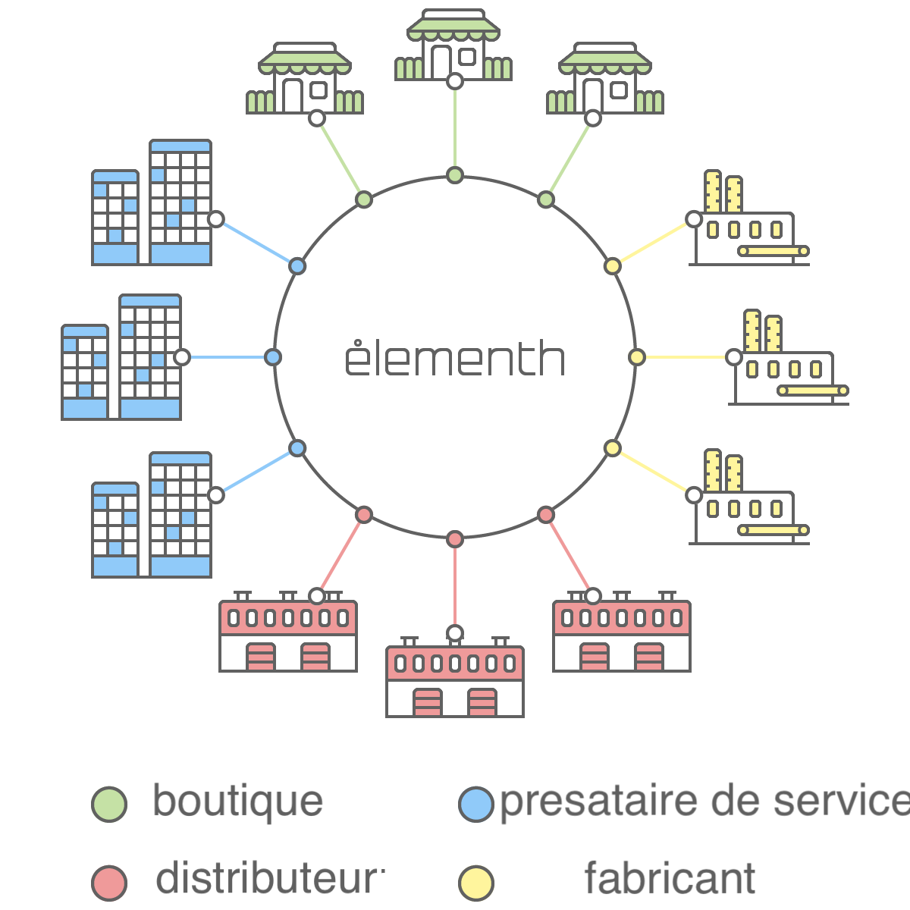
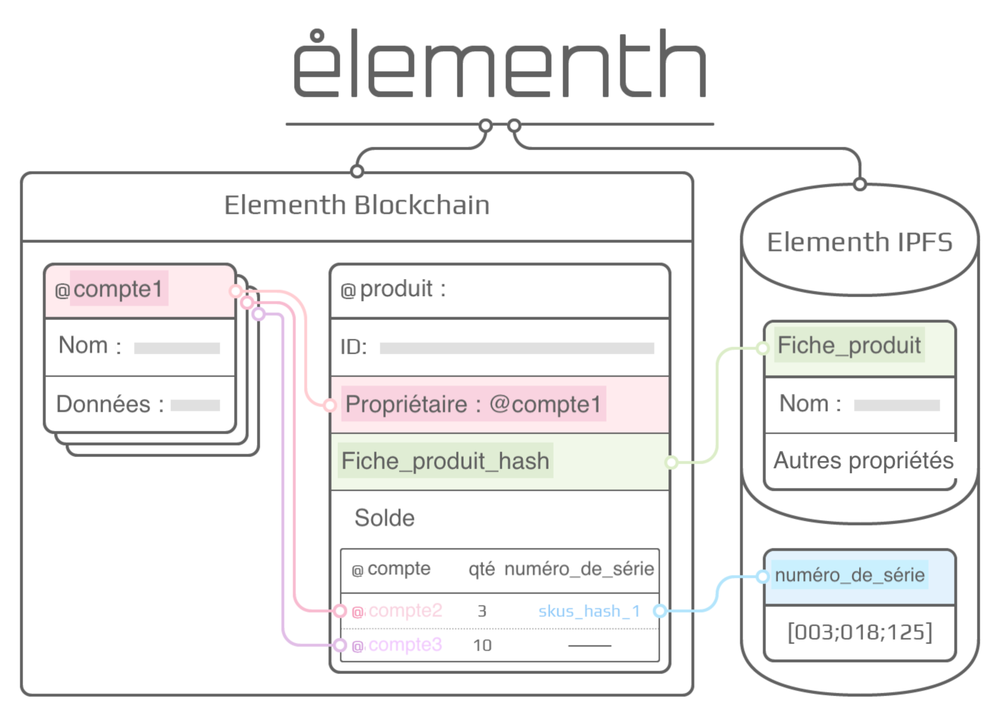
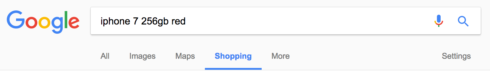
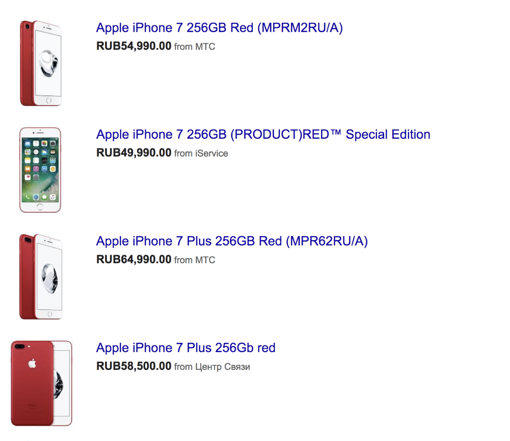
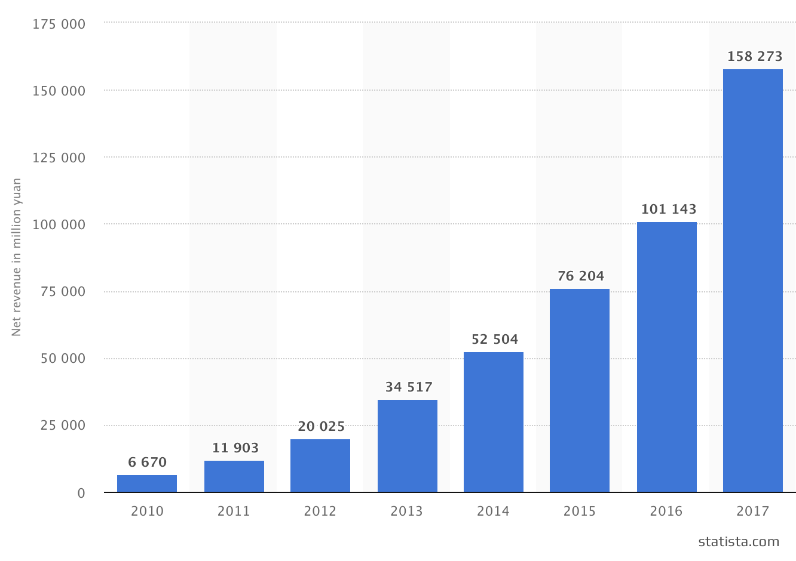
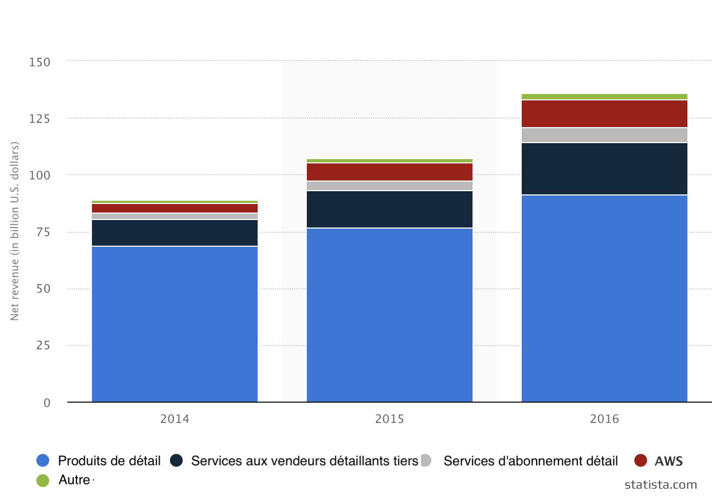
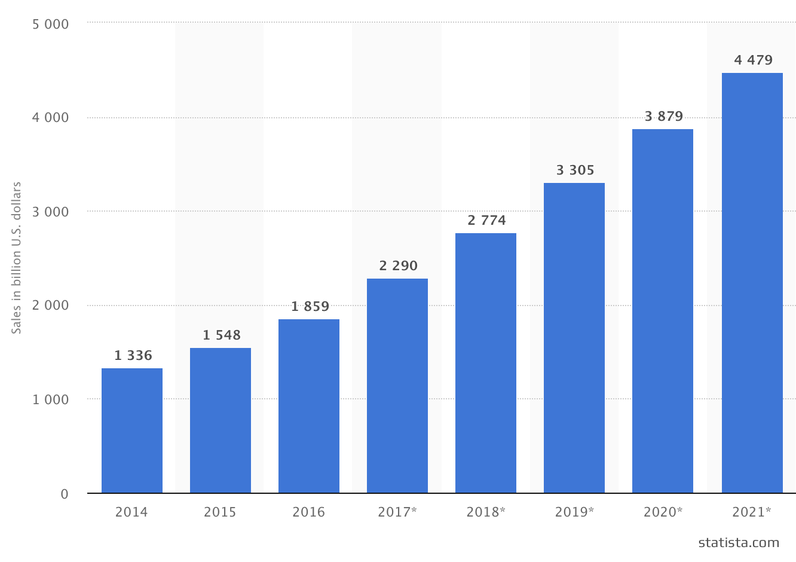

 

  

## Blockchain pour le commerce électronique

Depuis 2008, quand Bitcoin a été créé par Satoshi Nakamoto, les cryptomonnaies et la technologie blockchain prennent de plus en plus de place dans notre monde. Les limites de blockchain Bitcoin ont entraîné l'apparition d'un grand nombre de blockchains par exemple Ethereum [[2]](#references), qui permet de créer des contrats intelligents dans EOS [[3]](#references), la langue de programmation Turing-complet, en utilisant le protocole dPoS, ce qui rend le débit de la technologie blockchain des centaines et des milliers de fois plus important.  La technologie blockchain se rapproche du secteur réel de l'économie et de plus en plus de voies d'utilisations de blockchain en dehors du secteur financier sont discutées.

Elementh a récupéré les meilleures réalisations des dernières années dans le domaine de la blockchain, visant à résoudre les problèmes actuels du commerce électronique. Elementh est un blockchain pour le commerce électronique, disponible sous forme de registre de propriété des marchandises avec possibilité d'écriture de contrats intelligents spécialisés et d'utilisation de nomenclature standard pour créer rapidement des diverses applications, centralisées et décentralisées, pour le commerce électronique.

### Table des matières

 * **[Introduction au Bitcoin et aux notions existantes](#introduction-to-bitcoin-and-existing-concepts)**
   - [Historique](#background)
   * [Mises en applications alternatives de Blockchain](#alternative-blockchain-applications)
 - **[Blockchain pour le commerce électronique](#blockchain-and-e-commerce)**
   * [Marchés décentralisés](#decentralized-marketplaces)
   - [Questions relatives au commerce électronique](#e-commerce-issues)
 * **[Elementh](#elementh)**
   - [Système de marchandises](#system-of-goods)
   * [Nomenclature unifiée de marchandises](#unified-nomenclature-of-goods)
   - [Question d'origine des marchandises](#the-originality-of-goods)
   * [Comptes](#accounts)
   - [Transactions et messages](#transactions-and-messages)
   * [Blockchain](#blockchain)
   - [Protocole DPOS](#dpos-protocol)
   * [Profit par bloc](#reward-for-the-block)
   - [Le système de jetons électroniques](#the-system-of-tokens)
   * [Stockage de données des biens décentralisé](#decentralized-goods-data-storage)
   - [Étude de cas](#case-study)
   * [Associés](#partners)
   - [Équipe](#team)
   * [Consultants](#advisors)
   - [Marché](#market)
   * [Concurrents](#competitors)
   - [Produit](#product)
 * **[Affectations](#applications)**
   - [Devise et émission](#currency-and-issue)
 * **[Conclusion](#conclusion)**
   - [Références](#references)

### Introduction au Bitcoin et aux notions existantes

#### Historique

Le concept de monnaie numérique décentralisée, ainsi que ses affectations alternatives, telles que des registres de propriété, existent depuis plusieurs décennies. Les protocoles anonymes d'argent électronique des années 1980 et 1990 dépendaient principalement d'une cryptographie primitive connue sous le nom de Chaumian Blinding [[4]](#references). Chaumian Blinding autorisait la création de nouvelles devises à haut degré de confidentialité, mais ces principaux protocoles ne pouvaient pas être largement diffusés en raison de leur dépendance d'un agent centralisé. En 1998, b-money par Wei Dai [[5]](#references), c'était la première proposition à introduire l'idée de création d'argent en cours de calcul réalisé par ordinateur, à offrir un consensus décentralisé, mais cette proposition contenait peu d'informations sur la façon de sa mise en œuvre. En 2005, Hal Finney a introduit le concept de preuves de travail réutilisables, ce système utilise les idées de b-money en même temps que des énigmes difficiles pour ordinateur, Hashcash par Adam Back [[6]](#references), pour créer un concept de monnaie crypto, mais une fois de plus, s'appuyant sur une plateforme centralisée de calcul, il n'est pas devenu populaire. En 2009, pour la première fois la monnaie décentralisée a été mise en œuvre par Satoshi Nakamoto [[1]](#references), il a recombiné des bases établies par ses prédécesseurs pour créer des preuves de propriété à l'aide de cryptographie à clé publique avec un algorithme de consensus déterminant le propriétaire de monnaie, appelé « preuve de travail ».

#### Mises en applications alternatives de Blockchaine 

L'idée de prendre la technologie blockchain de base et de l'appliquer à d'autres concepts a également une longue histoire. En 2005, Nick Szabo a proposé un concept de protection des droits de propriété avec mandat au propriétaire [[7]](#references), qui décrit comment "de nouvelles avancées dans la technologie de bases de données répliquées" permettra l'utilisation d'un système de blocs pour stocker le registre de quelqu'un qui possède un terrain, créant une structure complexe qui comprend des concepts tels que manoir, squat ou bail précaire et taxe foncière. Malheureusement, à cette époque, il n'y avait pas de système de base de données répliqué efficace, ainsi le protocole n'a pas été mis en place. Cependant, après 2009, dès que le consensus décentralisé de Bitcoin a été développé, un certain nombre d'applications alternatives a vite surgi.

Certains inconvénients des contrats intelligents Bitcoin, surtout le manque de langue de programmation Turing-complète, ont causé l'apparition du blockchain Ethereum, un blockchain spécialisée qui permet d'écrire des contrats intelligents en Turing-complète. A l’avenir, Ethereum envisage de passer au protocole PoS mais il est encore actuellement sur le protocole PoW, ce qui affecte la vitesse et le coût des transactions dans le système. Une alternative prometteuse sera la blockchain EOS, qui est actuellement en cours d’élaboration. Elle offre la possibilité d’écrire des contrats smart, fonctionne sur le protocole DPD et facilite la création de diverses applications dApps décentralisées basées sur leurs propres blockchain.

### Blockchain pour le commerce électronique

Depuis l’avènement de la technologie de blocage, bien des gens ont essayé de la relier au commerce, principalement sous deux formats : création de places de marché décentralisées, telles que OpenBazaar, Syscoin, Particl etc. ; et systèmes de paiement par crypto-monnaies dans les magasins, tels que Monetha, TenX, Plutus et autres. Au fond, le deuxième groupe, vise à remplacer PayPal et se réfère plutôt au secteur financier, tandis que les marchés décentralisés tentent de combiner blockchain et cybercommerce.

#### Marchés décentralisés

OpenBazaar a été fondé en 2014 et maintenant on peut y trouver 1259 produits. Il fonctionne sur le principe de Bitcoin utilisant le protocole IPFS pour stocker les données.

Syscoin est actuellement testé et se base également sur Bitcoin.

Particl est en cours de développement et à l’heure actuelle, c’est juste un portefeuille pour stocker et transférer des jetons.

Tous les marchés décentralisés actuels héritent les lacunes des magasins en ligne et des cybermarchés préexistants, à savoir l'absence de standard de nomenclature, le manque d'informations sur les différents produits dans une carte unifiée et de garanties que le vendeur est en possession de produits présentés dans la boutique en ligne.

Il faut noter que les places de marché décentralisées ne sont pas des potentiels concurrents, mais les partenaires de la blockchain Elementh.

#### Questions relatives au commerce électronique

Historiquement, le système d'identification numérique EAN / CUP est le plus couramment utilisé dans le commerce [[8]](#references). À l'origine, le système américain CUP a été développé, il contient 12 chiffres pour l'encodage de marchandises et il a gagné une telle popularité que les pays européens se sont concentrés sur lui. Cependant, toute la gamme de codes était déjà impliquée dans l'encodage des marchandises des États-Unis et du Canada alors que les marchandises et les entreprises étaient exclusivement immatriculées aux États-Unis.  Les développeurs de l'encodage européen EAN-13 ont fait face à une tâche sérieuse : prolonger la série de codes et organiser un système d’enregistrement indépendant du celui de l'outre-mer assurant une compatibilité maximale avec l'encodage CUP.  La solution consistait à ajouter un treizième chiffre à la position la plus à gauche (il est généralement indiqué par le chiffre à gauche du code à barres) et utiliser 12 positions numériques comme dans CUP. En même temps, il a été possible de maintenir la compatibilité ascendante de EAN-13 avec le code CUP, ce dernier devenant un sous-ensemble de la codification EAN-13 avec 0 comme premier chiffre.

Les codes CUP ont été normalisés et enregistrés par UCC (Uniform Code Council, Inc.) aux États-Unis et le Conseil du commerce électronique du Canada (ECCC) au Canada. En 2005, ces organisations ont fusionné avec l’Association européenne de l’EAN et formé à l’Organisation mondiale de normalisation GS1 [[9]](#references).

Ce code a été créé principalement pour automatiser le commerce des biens produits par un grand nombre d’entreprises, ainsi la question du contenu interne était également importante pour la normalisation et la réglementation afin que de différentes entreprises ne puissent pas attribuer le même code au produit. Chaque type de marchandise nouvellement produite était censé avoir son propre code unique, et c'était l'idée principale de l'ensemble du système. Cela signifie que si, par exemple, un fabricant produit des jeans, alors des jeans de différentes couleurs, tailles, coupes, devraient avoir des codes différents. Ainsi, si nous avons, par exemple, 10 couleurs, 50 modèles, 20 tailles, puis nous avons besoin de 10 000 codes pour les coder.

À leur tour, les mêmes produits issus de fabricants différents, devrait aussi avoir un codage différent. Tout cela était important pour l'automatisation de la comptabilité dans le commerce, le contrôle automatique des stocks dans les entrepôts, les étagères des magasins et ainsi de suite.
Le maximum théorique du code GS1 est de 100 milliards types de marchandises différents (11 chiffres). Il semblerait qu'il s'agisse d'un nombre énorme, mais la théorie ne correspond pas toujours à la pratique, et la situation actuelle montre que, après plus de 30 ans de l'existence du système, ces codes sont insuffisants. Cela est dû à leurs dépenses déséquilibrées et au gaspillage.
Au départ, 11 chiffres du code ont été répartis comme suit :
1. chiffres pour le préfixe ;
2. chiffres pour le code du fabricant ;
3. chiffres pour le code de l'article de la marchandise.

Donc en théorie le système s'attendait à gérer jusqu'à six cent mille entreprises (cent mille par préfixe), chacune pouvant coder jusqu'à cent mille articles produits par elle.

Ainsi, à ce jour, des situations où des produits différents peuvent avoir le même code à barres ou le même article peut avoir différents codes à barres ne sont pas rares. La situation est encore aggravée par le fait que les détaillants souvent impriment simplement leurs propres codes à barres pour des marchandises variées vendues au poids, ainsi détruisant complètement le sens même des codes à barres uniques.

En outre, il faut comprendre qu’un code-barres identifie un produit, pas un spécifique SKU (Stock Keeping Unit). Pour comprendre ces derniers paramètres supplémentaires tels que le numéro de série, l'accise et d'autres types d'identification unique d'un SKU spécifique sont nécessaires.

Enfin, les codes-barres ne sont souvent pas entrés dans le système ERP par les grossistes, et chaque participant à la chaîne de vente utilise ses propres articles uniques pour différents types de marchandises.

### Elementh

  

L'objectif pour Elementh est de créer un protocole alternatif pour le développement d'applications décentralisées utilisées par le commerce électronique, fournissant une nomenclature standard de qualité, garantissant la propriété d'un produit spécifié et la capacité de créer des contrats intelligents spécialisés au commerce électronique.  Elementh y parviendra en créant une blockchain avec un langage de programmation intégré Turing-complet, permettant à chacun d'écrire des contrats intelligents et des applications décentralisées, permettant l'utilisation de cartes de produits, de transactions de commerce électronique et du transfert de propriété unifiés.
 
 
 
 
#### Système de marchandises

  

Avec le système de jetons, Elementh dispose d’un système de marchandises, qui peut également être utilisé dans un grand nombre d'applications, telles que suivi du mouvement d'un élément particulier depuis sa création au propriétaire actuel, suivi des marchandises originales et détection des contrefaçons.  Contrairement au système de jetons, le système de marchandises prévoit également la possibilité de « délivrer » un produit particulier à une adresse particulière, en indiquant toutes les données possibles de l'élément (comme le nom, le fabricant, le code à barres, etc.). Et si des marchandises identiques sont déjà présentes dans le blockchain, l'émetteur recevra un message à ce sujet, et il aura la possibilité d'indiquer le nombre d'articles de marchandises qu'il veut «délivrer».
 
Si un élément a un numéro de série, il est possible de le spécifier lorsque l'opération de transfert est effectuée. Pour assurer la protection contre la falsification de données, seul le hachage du numéro de série est fixé dans le système, donc seule la personne qui connaît le numéro initial a la possibilité de faire une transaction valide.
En l'absence d'un numéro de série au moment de la « délivrance » des marchandises, le système en génère un au hasard et le détenteur est en mesure de l'utiliser pour identifier un article particulier de marchandises en imprimant le code QR sur l'emballage, de l'écrire dans une étiquette RFID ou de toute autre manière commode.

#### Nomenclature unifiée de marchandises

Chaque fournisseur / distributeur / vendeur dans le monde a son propre format de données pour les biens et, plus important encore, sa propre nomenclature. Leur nombre est énorme et croissant tous les jours. Par exemple, jetons un coup d'oeil au résultat de recherche dans Google.shopping pour "iPhone 7 Go rouge" :

   
   

Comme vous pouvez le voir, chaque magasin a un nom différent pour le produit, tandis que les résultats de recherche présentent également un autre modèle d'iPhone, suivi par l'iPhone 7 256 Go d'autres couleurs et ainsi de suite. Une solution évidente à ce problème est la création d'une nomenclature des marchandises unifiée qui permettra aux utilisateurs de voir des offres pour le produit d'intérêt sur une carte de marchandises et magasins pour choisir les fournisseurs qui sont les plus bénéfiques pour eux.

L'une des caractéristiques essentielles pour Elementh est la disponibilité d'une nomenclature unifiée.  Pour s'assurer que les cartes de marchandises sont aussi complètes et précises que possible, et pour réduire la probabilité de créer des cartes en double, le coût de création et d'utilisation de la carte sera différent.  Pour créer une carte de marchandise, un participant devra payer, par exemple, 1 EEE (le prix sera fixé par le vote des délégués). Au moment où le propriétaire ajoute l'article au système, il lui est proposé d'utiliser une carte existante ou d'en créer une nouvelle. L'utilisation d'une carte existante coûte 100 fois moins cher que la création d'une nouvelle carte (par exemple, 0,01 EEE).  Le détenteur reçoit une récompense pour chaque propriétaire de marchandises qui utilise sa carte, ainsi que pour effectuer une transaction à l'aide de cette carte. Tout participant au système peut compléter l'information contenue dans les cartes existantes, et le détenteur de la carte peut accepter ou refuser les modifications proposées.
 

#### Question d'origine des marchandises

Les marchandises dans le système existent en un seul exemplaire et si un article avec le même numéro de série est ajouté au système, tout dApp peut aviser l'acheteur que l'origine de la marchandise est inconnue. Si la chaîne de propriété provient du fabricant, la confirmation de l'originalité des marchandises sera présente sur l'ensemble du réseau.

#### Comptes

Le compte est l'un des objets de base dans Elementh, il est utilisé comme identité des participants du réseau. Pour chaque compte il y a :
 solde du compte de la crypto-monnaie interne EEE;
 information sur la propriété des marchandises.

Toutes les transactions dans la chaîne de blocs sont effectuées entre comptes.

#### Transactions et messages

Toute action dans la blockchain Elementh est appelée transaction. Les transactions les plus simples sont le transfert de la valeur EEE entre les comptes et la définition du propriétaire des biens. La transaction peut inclure un message structuré pour le destinataire. Les comptes peuvent définir des scénarios pour traiter ces messages à réception. La combinaison de messages et de scripts automatisés est un sous-système de contrats intelligents dans Elementh.

#### Blockchaine

Les transactions dans la chaîne de blocs doivent être sûres, non ambiguës et irréversibles, et être effectuées le plus rapidement possible pour faciliter la fiabilité et la décentralisation du système. En pratique, les difficultés surgissent dans deux aspects différents de ce processus : choisir un nœud unique pour la production du bloc et rendre l'enregistrement irréversible.

#### Protocole DPOS

Selon le concept de sociétés décentralisées autonomes SDA, la décentralisation signifie que chaque actionnaire a une influence proportionnelle au nombre de ses actions et que la décision prise par vote de 51 % des actionnaires est irréversible et obligatoire. Le défi consiste à déterminer comment atteindre 51 % du seuil d'approbation de façon opportune et efficiente.

Pour atteindre cet objectif, chaque actionnaire peut déléguer son droit de vote à un délégué. 100 délégués avec le plus grand nombre de votes délégués génèrent des blocs selon un certain calendrier. Chaque délégué est alloué un laps de temps pour la production du bloc. S'il ne produit pas de bloc, son tour est sauté, et le prochain délégué produit un bloc selon l'ordre listé. Tous les délégués reçoivent un paiement égal à 10 % de la taille moyenne de la commission de transaction. Si le bloc du milieu contient un honoraire de 100 actions, le délégué recevra 1 action en paiement.

Un retard du réseau peut empêcher certains délégués de générer leur bloc en un délai raisonnable, et cela conduira à une rupture de la chaîne des blocs. Toutefois, dans la pratique, il est peu probable que cela se produise, car un délégué peut établir des connexions directes avec d'autres délégués qui le précèdent et le suivent dans la chaîne. Avec ce modèle, de nouveaux blocs peuvent être générés toutes les 10-30 secondes et dans des conditions de réseau normales, les fissures de la chaîne de blocs sont improbables ou peuvent être corrigées en quelques minutes.

#### Profit par bloc

La chaîne de blocs qui utilisera le logiciel Elementh sera attribuée avec de nouveaux jetons du fabricant de bloc à chaque fois que l'unité sera créée. Le logiciel Elementh peut être configuré de manière à ce que le paiement des fabricants de blocs soit limité de sorte que l'augmentation annuelle totale du nombre de jetons ne dépasse pas 5 %.

#### Le système de jetons électroniques

Le système de jetons peut être utilisé dans un grand nombre d'applications allant de la reliure à des actifs tels que le dollar américain ou l'or jusqu'aux actions d'entreprise. Le système de jetons est facile à mettre en œuvre dans la chaîne de blocs Elementh. Afin de mieux comprendre ce qu'est un système de jetons, vous pouvez imaginer une base de données avec une seule opération : prendre X unités de A et les transférer à B, dans les conditions suivantes : 1) A possède au moins X unités avant la transaction et 2) la transaction est confirmée par A. Pour réaliser ce système il est nécessaire et suffisant de mettre en œuvre un contrat intelligent avec la logique décrite ci-dessus.

#### Stockage de données des biens décentralisé

Elementh utilise le protocole IPFS pour stocker les données de marchandises telles que les spécifications, photos, codes EAN, numéros de série et autres.
IPFS (ou InterPlanetary File System, système de fichier interplanétaire), est un protocole pair à pair de communication de contenu adressable par hypermédia. IPFS vous permet de créer des applications entièrement distribuées. Il vise à rendre le Web plus rapide, plus sûr et plus ouvert.
 
IPFS est un système de fichiers distribué pair à pair qui relie tous les périphériques informatiques à un seul système de fichiers. . En un sens, IPFS est semblable au World Wide Web. IPFS peut être représenté comme un seul essaim bittorrent, qui échange des fichiers d'un seul dépôt Git [[10]](#references).
IPFS devient un nouveau sous-système important du World Wide Web. Construit correctement, il est capable de compléter ou de remplacer complètement le protocole HTTP. Il peut également compléter ou remplacer d'autres systèmes.

#### Étude de cas

Jacques, propriétaire d'un petit commerce, a été informé sur la chaîne de blocs Elementh et sur les opportunités qu'elle offre. Jacques n'avait rien vendu sur Internet jusque-là. Ayant pris connaissance des nouvelles possibilités, il a décidé qu'il était temps d'essayer de vendre ses chaussures via la chaîne de blocs Elementh, en utilisant les applications spéciales pour vendeurs. L'installation d'un magasin s'est révélée être tout à fait simple et a pris quelques minutes.

  

Après avoir relié son programme de comptabilité à l'application, Jacques a réussi à lui faire reconnaître le solde des stocks et à le lier à une nomenclature unique avec les bonnes cartes de marchandises et les données complètes sur les caractéristiques des produits. Les Informations sur les marchandises de Jacques sont immédiatement devenues disponibles à tous les membres du réseau Elementh. Stéphane a vu la disponibilité des bottes dont il avait besoin dans ce magasin, a immédiatement passé commande, et Jacques a reçu notification que Steve voulait acheter ses chaussures. L'argent du client est immédiatement transféré à un contrat intelligent, ce qui signifie que la commande est réelle. Ayant organisé la livraison des marchandises à Stéphane, Jacques retourne à son travail habituel au magasin. Aussitôt que les marchandises ont été livrées, l'argent a été transféré au compte de Jacques, ce qui signifie qu'il a pu investir le profit dans un nouveau produit quasi immédiatement.

Un jour, Jacques décide d'élargir la gamme de produits et de vendre des sacs de marque, pour accompagner les chaussures. Sans hésitation, il a ouvert l'application de commerce interentreprises pour trouver des fournisseurs et des fabricants travaillant dans la blockchain Elementh et a trouvé le fabricant de sacs LOUIS VUITTON. Il a passé commande, transférant la monnaie crypto au contrat intelligent. Dès que le fournisseur est informé sur la commande de Jacques, il se prépare à expédier le produit et transfère les numéros de série correspondants au contrat intelligent. Maintenant que la transaction est en cours, tout le monde pourra vérifier que Jack a des sacs LOUIS VUITTON authentiques dans son magasin et non des faux. En effet, dans le réseau d'Elementh, chaque fabricant peut suivre le mouvement des marchandises et si plusieurs propriétaires du même numéro de série d'un produit apparaissent, cela indique contrefaçon, son origine est facile à détecter et le producteur peut aisément prendre les mesures nécessaires pour informer les clients de son existence.

Stéphane utilise depuis longtemps des applications pour trouver les meilleurs prix pour le produit dont il a besoin.   Aujourd'hui, il a décidé que le moment était venu de commander de nouvelles chaussures et quelques instants, il a trouvé la paire qu'il fallait dans le magasin de Jacques et a passé commande, envoyant l'argent au contrat intelligent. Stéphane n'a pas peur de faire des achats en ligne et d'envoyer de l'argent à des vendeurs inconnus depuis longtemps. Si Stéphane ne reçoit pas la marchandise, il l'indiquera simplement dans le contrat intelligent et l'argent lui sera rendu. Cette fois, sa commande a été traitée presque instantanément et le colis est arrivé une heure plus tard. Après vérification de la bonne qualité des chaussures, Stéphane rempli le contrat intelligent, l'argent est transmis à Jacques tandis que Stéphane devient propriétaire d'une nouvelle paire de chaussures. Il peut facilement vendre cette paire de chaussures sur le marché secondaire dès qu'il s'en lasse car le réseau Elementh sait qu'il a des articles authentiques et non des contrefaçons. Il pourra les mettre en vente en deux clics seulement.

### Affectations

En général, il y a deux types d'applications construites sur Elementh. La première catégorie contient les applications financières. Elles fournissent aux utilisateurs des possibilités fabuleuses, telles que gérer et participer aux contrats monétaires, y compris dans le but d’achat et de vente de produits et contenus en ligne et hors ligne, ainsi que des jetons basés sur le logiciel Elementh. La deuxième regroupe les applications non financières, telles que l'identification de faux/contrefaçons dans la chaîne d'approvisionnement, etc.
 
1. **Marchés décentralisés basés sur Elementh**. Sur la base des blockchaines Elementh, tout marché pourra permettre aux vendeurs d'utiliser les cartes de marchandises existantes sans en créer de nouvelles. Les données sur la propriété du produit vous permettront de débarrasser le marché de produits contrefaits. Les cartes de marchandises unifiées permettront de facilement trouver le prix le plus bas pour n'importe quel produit. En plus, il devient possible de payer en n'importe quelle devise crypto.
2. **Suivi de la circulation des marchandises**. La chaîne complète producteur-distributeur-vendeur-acheteur, stockée dans la blockchain Elementh, permettra de trouver des fournisseurs pour tout volume de produits, jusqu'à commande directe de marchandises auprès du fabricant.  Nous y voyons l'avenir du commerce électronique.
3. **Recherche de marchandises par géolocalisation**. Les informations sur le vendeur, disponibles dans la blockchaine d'Elementh vous permettent de trouver où l'achat pour n'importe quel article sera le plus commode.
4. **Envoi décentralisé de messages**. La messagerie vous permet de contacter directement tout participant à la transaction. Cela permettra de mettre en place des systèmes d'échange, d'enchérir, d'obtenir des conditions d'achat individuelles et ainsi de suite.
5. **Concepteur de magasin**. Disposant de toutes les données nécessaires pour paramétrer un point de vente, le système vous permet de créer des vitrines décentralisées individuelles pour n'importe quel fournisseur du système.
6. **Recherche de faux**. Les données sur tous les participants à la chaîne permettront de suivre l'apparition de produits contrefaits à n'importe quel stade du transfert de propriété des marchandises.
7. **Scoring bancaire**. L'accès aux données sur toutes les transactions de tout participant au système permettra une notation instantanée du vendeur, ce qui permet de construire des systèmes de crédit et de découvert auprès des établissements bancaires.
8. **Verticales différentes**. Elementh blockchain peut être utilisée par n'importe quel prestataire de services, par exemple, les hôtels ou les compagnies aériennes pour stocker des informations et suivre la propriété de billet, coupon ou bon d'achat.
 
#### Devise et émission

Elementh blockchain a sa propre devise intégrée, elementh (EEE), qui sert à deux fins : premièrement, fournir une liquidité de base, qui à son tour assure un échange efficace entre différents types d'actifs numériques, et, deuxièmement et surtout, pour le paiement des frais de transaction.

Informations sur les jetons numériques et l'ICO : EEE, norme ERC-20 
Offre totale : 303 000 000 EEE 
Distribution de jetons : 
217 500 000 (71,78 %) EEE : investisseurs 
45 000 000 (14,85 %) EEE : équipe 
40 500 000 (13,37 %) EEE : associés et conseillers 
 
Date de début de prévente privée : 15 janvier 2018 00:00 UTC 
Date de fin de prévente privée : 31 janvier 2018 23:59 UTC 
Plafond souple de la prévente privée : - 
Montant maximum de fonds à assembler en prévente privée : 1 500 ETH 
Prix de prévente privée : 1 EEE = 0.0001 ETH 
Système de bonus de prévente privée : 50 % jetons numériques 
 
Date de début de pré-ICO : 1er février 2018 00:00 UTC 
Date de fin de pré-ICO : 14 février 2018 23:59 UTC 
Plafond souple de pré-ICO : - 
Hard cap de pré-ICO : 1 500 ETH moins reçu en prévente privée 
Prix pré-ICO : 1 EEE = 0.0001 ETH 
Programme de bonus ICO : 1er jour : 30 % jetons, 2ème jour : 15 % jetons 
 
Date de début d'ICO : 1 mars 2018 00:00 UTC 
Date de fin d'ICO : 31 mars 2018 23:59 UTC 
Plafond souple ICO : 10 000 ETH 
Montant maximum de fonds à assembler en ICO : 30 000 ETH 
Prix ICO : 1 EEE = 0.0002 ETH 
Programme de bonus ICO : 1er jour : 30 % jetons, 2ème jour : 15 % jetons 

### Partenaires

Depuis 2012, nous avons une entreprise en Russie appelée [Miiix](http://miiix.org/). Elle fonctionne en ce moment, nous avons plus de 200 magasins en ligne et les marchés travaillent avec nous. Un de ces magasins était Ulmart et nous avons effectué un connecteur à SAP Hybris, de sorte qu'ils puissent utiliser la nomenclature appariée de biens pour leur site marchand. Puisqu'Ulmart a des problèmes commerciaux en ce moment, ce connecteur n'a pas été complètement implémenté dans son business.  Nous avons également discuté avec SAP et SAP Hybris en Russie de l'opportunité de présenter cette solution à d'autres clients SAP dans le monde entier. En 2018, nous allons participer au programme SAP COIL pour tout tester et utiliser cette solution chez SAP Store.

Un des clients de Miiix est Sberbank AST : la plus grande plate-forme d'appel d'offres en Russie. Ils ont besoin d'y apparier les produits de différents fournisseurs. Nous traitons environ 2 000 000 UGS par mois pour eux en ce moment.

Nous avons également plus de 200 petites et moyennes boutiques en ligne et des places de marché comme clients chez Miiix.

### Équipe

L'équipe du projet se compose de 10 membres dont trois fondateurs, ils ont travaillé ensemble pendant des années, ce qui est très positif pour le projet. Les fondateurs ont beaucoup d’expérience dans le domaine du cybercommerce qui est le champ cible du projet Elementh. Leur expérience n'est pas limitée à [Miiix](http://miiix.org/), ils ont également développé une plate-forme pour la vente de stocks non liquides de détaillants [Smallhorse](http://smallhorse.ru/) et quelques autres produits plus tôt.

[Sergei Ryabov](https://www.linkedin.com/in/sergey-ryabov-20108765/), PDG 
Il crée des projets en ligne depuis 2001. Création et lancement d'un certain nombre de projets en ligne, parmi lesquels système de publicité contextuelle, bureau d'enregistrement de domaines, recommandations et studio Web. Tous ces produits ont été avec succès vendus aux partenaires et d'autres entreprises plus grandes. Après cela, les fondateurs ont lancés plusieurs magasins en ligne, [Prestigewheels](https://prestigewheels.ru/) et [Sportmanya](http://sportmanya.ru/). Pour faire face au problème de réalité d'excédent et ils ont créé le service de projet [Miiix](http://miiix.org/). 
Il a vendu ses magasins et s'est concentré sur le projet Miiix. Le projet a reçu le prix Startup of the Year 2013 Award en Russie et existe toujours. En 2017, le projet est intégré à SAP Hybris pour utiliser les algorithmes d'appariement des produits pour les principaux marchés et détaillants mondiaux. En 2016, il crée avec Dimitri Kossyguine, principal actionnaire d'Ulmart, une plateforme de vente de surplus non liquide des détaillants [Smallhorse](http://smallhorse.ru/).

[Dimitri Bereznitski](https://www.linkedin.com/in/bdmitry/), directeur technique 
Directeur technique et partenaire dans les projets [Miiix](http://miiix.org/) et [Smallhorse](http://smallhorse.ru/). Depuis 2006, il développe un système de magasins affiliés afin d'attirer du trafic vers les principaux marchés tels que Amazon. Expérience de développement web commercial de plus de 15 ans, expérience de commerce électronique de plus de 10 ans. Gestion d'équipes de développement pendant plus de 7 ans. Évangéliste de méthodologie Agile, Lean Startup et Théorie de Contraintes.

[Vitaly Mengeshev](https://www.linkedin.com/in/vitalii-mengeshev-aba47a14b/), chef de direction 
Directeur opérationnel et associé dans les projets Miiix et Smallhorse. Un des conférenciers dans les programmes d'accélération de démarrage IdealMachine et Skolkovo. De 2002 à 2012, il a créé et développait activement sa propre marque de vêtements. A partir de 2013, il rejoint l'équipe Miiix et prend en charge la direction opérationnelle et le développement commercial.

[Aleksandr Vassiliev](https://www.linkedin.com/in/aleksandr-vasilev-4bab3425/), chercheur de données 
Aleksandr possède une vaste expérience dans le développement de systèmes d'analyse prédictive et d'analyses de données dans des domaines tels que l'assurance, le secteur bancaire et le commerce électronique. Dans l'entreprise, Aleksandr résout avec succès le problème de l'appariement des produits à partir de diverses sources de données en utilisant les derniers développements mondiaux dans le domaine de l'apprentissage machine.

[Sergei Morozov](https://www.linkedin.com/in/sergey-morozov-aba83b80/), développeur backend 
Sergei a plus de 7 ans d'expérience dans le développement. Architecte de système et administrateur de bases de données de types divers. Expérience dans la construction de systèmes en temps réel hautement chargés. Participation au développement du service SAAS pour plus de 800 000 utilisateurs. Il a été engagé dans le développement d'un grand nombre de systèmes de traitement des données : des systèmes pour le travail des rédacteurs aux systèmes comptables financiers. Un fan de longue date de la technologie blockchain.

[Eugene Prigornitskiy](https://www.linkedin.com/in/evgeniy-prigornitskiy-67566077/), développeur backend 
10 ans de développement commercial. Participation au développement de systèmes de paiement, progiciels de gestion, applications mobiles (iOS, Android, Windows Phone). Expérience dans la construction de systèmes en temps réel hautement chargés. Possède une vaste expérience de développement de bases de données.
développement.

[Roman Travnikov](https://www.linkedin.com/in/travnikovrn/), développeur frontend 
Plus de 6 ans de développement commercial. Une riche liste de projets mis en œuvre : des sites d'entreprises aux portails de sociétés d'État, de ministères et de grandes banques.  La dernière année et demie a travaillé sur des projets Miiix et SmallHorse. Utilise
des technologies de pointe dans le développement pour maximiser la performance de services.

[Sergei Miheev](https://www.linkedin.com/in/sergey-mikheev-54168a62/), administrateur système 
Il a commencé à travailler avec crypto-devises et blockchain en 2016. Auparavant, Sergei a travaillé comme expert technique sur la mise en œuvre et le support de progiciels de gestion et de bases de données sur de grands sites de production.

[Peter Gashnitsky](https://www.linkedin.com/in/peter-gashitsky-b08553157/), concepteur d'ergonomie 
Concepteur et graphiste du web et illustrateur expérimenté. Son slogan est « projets propres, design épuré ». Parle beaucoup et dessine beaucoup. Préfère le café.

[Alexander Kholodnykh](https://www.linkedin.com/in/ni-moc-nideknil-www/), développeur backend 
Spécialisé dans l'analyse du Web, l'automatisation des processus, la résolution de tâches serveur. Sa fonction dans l'équipe de développer de robots d'exploration de la toile et de trouver des informations sur les biens et les prix. 9 ans d'expérience de développement commercial.

### Consultats

Elementh Project a des conseillers, qui ont une grande expérience en tant qu'entrepreneurs et experts en affaires informatiques. La disponibilité de tels conseillers sera sans aucun doute bénéfique pour le projet.

[Naveen Yannam](https://www.linkedin.com/in/naveen-yannam-1553a91/), conseiller technique et premier collaborateur 
Naveen est un développeur certifié de base Hybris 5 et commerce. Il possède une vaste expérience dans l'utilisation de divers frameworks et bibliothèques pour implémenter des applications de classe entreprise. Il est également un fervent promoteur de méthodologies Agile et a réussi à exercer des techniques agile dans les projets auxquels il a participé. Naveen est à l'aise dans le travail en tant que responsable technique Hybris, idéalement dans une équipe de projet développant des systèmes de commerce électronique de grande échelle avec des méthodologies d'intégration et de livraison continues.

[Proorocu Aurel George](https://www.linkedin.com/in/aurelp), conseiller en marketing 
Aurel était en 2016 l'un des "100 Visages d'Innovation" du Financial Times en raison de sa contribution au développement du marché Internet en Roumanie. Il a plus de 14 ans d'expérience dans le domaine du marketing informatique et numérique, travaillant pour des entreprises comme Google Enterprise, Orange et Keyence. Aurel est également le plus jeune diplômé du programme Exécutive MBA de l'Institut Mines Telecom.

[Michael Averbach](https://www.linkedin.com/in/michael-averbach-40720b/), conseiller finance 
Plus de 20 ans d'expérience dans les affaires informatiques, entrepreneur en série, investisseur. Compétences clés : création de modèles d'entreprise, de stratégies de marketing et de vente, création d'applications et de dispositifs mobiles, commerce électronique et logiciels corporatifs, gestion des processus de développement logiciel. Co-fondateur d'Ectaco, Inc. (États-Unis) - un chef de file dans le développement de traducteurs électroniques et de solutions linguistiques, où il gérait le réseau de vente, composé de 13 bureaux de vente à l'étranger et de dizaines de distributeurs indépendants à travers le monde. A fondé MobiDealer, Inc., (les USA), où a géré la création de progiciel de système ERP distribué. L'entreprise a été vendue à un investisseur stratégique suite au succès de lancement.
Co-fondateur de DynoPlex, Inc. aux États-Unis.  Il a fait de la société l'un des plus grands développeurs d'applications mobiles. Succès de la vente de la société et transition vers la gestion du développement à l'étranger pour l'acheteur, Quickoffice, Inc. (Etats-Unis), où il dirige deux centres étrangers pour le développement d'applications mobiles, en tout 140 ingénieurs.  La société a ensuite été vendue à Google en 2012.  Après la vente de Quickoffice, a lancé un fonds de capital-risque RSV Venture Partners et agit en tant qu'associé gérant de Startup-Accelerator iDealMachine, où il investit dans des entreprises à un stade très précoce.

[Sergei Fradkov](https://www.linkedin.com/in/sfradkov/), conseiller juridique 
Sergei Fradkov est un visionnaire et investisseur expérimenté dans le domaine des logiciels, avec une vaste expérience technique et commerciale. M. Fradkov est l'un des fondateurs d'iDealMachine, un fonds de capital de risque et un accélérateur de démarrage qui fonctionne à Saint-Pétersbourg, en Russie, et qui est en pleine expansion à l'échelle nationale et internationale.  Avant cela, M. Fradkov était un fondateur de plusieurs startups de haute technologie. Sa dernière entreprise, DynoPlex, a été vendue à un concurrent, Quickoffice, en 2008 et Quickoffice a été racheté par Google en 2012. Avant cela, M. Fradkov a cofondé w-Trade, une entreprise pionnière d'applications sans fil, où il a amassé plus de 40 millions de dollars et a construit un produit qui a été vendu à de grandes institutions financières, comme Merrill Lynch, Fidelity, Morgan Stanley et d'autres. Au total, il compte plus de 25 ans d'expérience dans le développement et la conception de systèmes distribués, sans fil et de commerce électronique, ainsi que dans la gestion de grandes équipes de développement de produits.  M. Fradkov est diplômé de l'Université de Jérusalem.

### Marché

En 2016, le commerce électronique au détail s’est élevé à 1915 milliards de dollars au niveau mondial. Elles
devraient atteindre 4058 milliards de dollars.

  
Chiffre d'affaires net en millions de yuans

Amazon est le plus grand marché au monde. Ses revenus ont dépassé 125 milliards de dollars en 
2016.

  
Chiffre d'affaires net en milliards de dollars américains

La plus grande société de portefeuille en Chine est le Groupe Alibaba.

  
Chiffre d'affaires net en milliards de dollars américains

Elementh Blockchain peut être utilisé par n'importe quel marché et magasin en ligne dans le monde pour la nomenclature standard et le système de marchandises. Le commerce électronique est un marché en croissance dans tous les pays et la popularité des marchés décentralisés est un avantage pour la Fondation Elementh. Si nous nous associons à tous les nouveaux marchés, notre blockchain peut devenir une norme du marché du commerce électronique.

### Concurrents

Les concurrents directs du projet sont les projets existants de commerce électronique interentreprises en ligne, tels que Indix. Dans ce segment, le projet Elementh est une utilisation novatrice de Blockchain et peut être utilisé par des marchés décentralisés qui utilisent crypto-monnaies pour les paiements internes.
D'autres concurrents de la chaine Elementh sont des plateformes Blockchain pour le commerce électronique, par exemple le VeChain, l'écosystème INS, Connectius, Flipz, StopTheFakes, etc. Il est intéressant de noter que certains d'entre eux sont des produits de niche, et que tous ne sont pas vraiment des plates-formes d'infrastructure, mais plutôt des applications de contrats intelligents pour le commerce électronique. 
Nous pensons qu'Elementh est davantage un projet d'infrastructure et peut être utilisé par différents marchés et plateformes. En outre, un avantage important pour Elementh est une grande expérience dans le marché du commerce électronique interentreprises depuis 2012 et les affaires en cours avec de vrais clients. 
Des marchés différents sont aussi une sorte de concurrents pour le projet d'Elementh, parce qu'ils peuvent être développés sans Elementh et dans ce cas ils travailleront au même marché.  Il est très important pour l'équipe Elementh de s'associer à tous les marchés décentralisés existants ou qui vont bientôt démarrer.

### Produit

Le projet Elementh est issu du produit [Miiix](http://miiix.org/) développé depuis 2012. Comme énoncé précédemment, Miiix est pleinement opérationnel en Russie qui ont des investissements de RSV Venture Partners et les investisseurs providentiels et des partenariats solides, par exemple, avec Sberbank AST et SAP Hybris et plus de 200 petites et moyennes boutiques et marchés en ligne.

Miiix a plusieurs récompenses :
 * Vainqueur du prix Startup of the Year 2013 de l'Ecole Supérieure d'Economie
 * Vainqueur d'IT-Startup Eurasia
 * Vainqueur de CloudsNN
 * 2e place dans StartupCup
 * Finaliste de Bootcamp Ventures Innovation Xchange (iX), Tel Aviv
 * Finaliste de WebReady
 * Finaliste de MABA
 * Finaliste de VC Day Ingria
 * Finaliste de Zvorykin Prize
 * Demi-finale de Startup World Barcelona
 * Demi-finale de Mind the Bridge Trenro, Italie

### Conclusion

Le protocole Elementh a été conçu à l'origine comme une version améliorée de la devise crypto, fournissant des fonctions avancées au commerce électronique telles que la propriété du produit, les contrats financiers, etc. Le protocole Elementh ne supportera aucune des applications directement, mais la présence du langage de programmation complet Turing signifie que des contrats théoriquement arbitraires peuvent être créés pour n'importe quel type de transactions et d'applications. Ce qui est encore plus intéressant, c'est que le protocole Elementh est allé beaucoup plus loin que la monnaie cryptographique habituelle. Le protocole qui peut être utilisé pour créer des marchés décentralisés, identifier les produits contrefaits, et bien plus encore, a un énorme potentiel d'améliorer considérablement l'efficacité de l'industrie du commerce électronique et peut donner un coup de fouet au développement d'autres pair-à-pair par adjonction de la première couche économique.

Le concept d'une fonction arbitraire de transition d'état, ainsi que la propriété des biens, mis en œuvre dans le protocole Elementh, donne à la plate-forme un potentiel unique.  Au lieu d'être un protocole fermé, ciblé sur un ensemble spécifique d'applications dans le domaine du stockage de données, des jeux d'argent ou de la finance, Elementh est un protocole général ouvert. Nous croyons fermement qu'il est très bien adapté pour servir de base pour un très grand nombre de protocoles financiers et non financiers dans un avenir proche.
 
 
### Références

1. Nakamoto, S. 31 octobre 2008. "Bitcoin: A Peer-to-Peer Electronic Cash System". Aussi connu sous le nom de livre blanc Bitcoin. http://nakamotoinstitute.org/bitcoin/. http://bitcoin.org/bitcoin.pdf. https://github.com/saivann/bitcoinwhitepaper.
2. Buterin, V. 01 septembre 2014. Ethereum livre blanc. https://github.com/ethereum/wiki/wiki/White-Paper.
3. Larimer D. 06 juin 2017. EOS.io livre blanc. https://github.com/EOSIO/Documentation.
4. "Blind signature". Dernière modification le 29 mars 2017. Wikipédia. https://en.wikipedia.org/wiki/Blind_signature.
5. Dai, W. U.d. "B-money". http://www.weidai.com/bmoney.txt.
6. Back, A. U.d. Hashcash. http://www.hashcash.org/.
7. Szabo, N. 1998. "Secure property titles with owner authority". http://szabo.best.vwh.net/securetitle.html. Impossible d'accéder 20 septembre 2017. Lien alternatif ici : http://nakamotoinstitute.org/secure-property-titles/.
8. "Universal Product Code". Dernière modification le 02 novembre 2016. Wikipédia. https://ru.wikipedia.org/wiki/Universal_Product_Code.
9. "GS1". Dernière modification le 26 mars 2015. Wikipédia. https://ru.wikipedia.org/wiki/GS1 .
10. InterPlanetary File System https://en.wikipedia.org/wiki/InterPlanetary_File_System

**Avertissement :** Ce projet de livre blanc technique Elementh est publié uniquement à titre d'information. Elementh ne garantit pas l'exactitude ou les conclusions formulées dans ce document, et ce document est fourni « tel quel ». Elementh ne garantit pas l'exactitude des conclusions formulées dans le présent document, le délivre "tel quel", sans garantie d'exhaustivité de la couverture et sans garantie explicite ou implicite des conditions énumérées (mais non limitée à) : (i) pertinence commerciale, possibilité d'utilisation spécifique, dénomination ou non-respect des droits ; (ii) absence d'erreurs dans le texte, possibilité d'utilisation à des fins spécifiques ; et (iii) non-atteinte-aux-droits de tiers par le contenu du présent document. Elementh et ses entités affiliées renoncent à toute responsabilité et à tout dommage éventuel pouvant découler de l'utilisation, de la mention ou de la confiance accordée aux informations contenues dans le présent document, ainsi que tout avis avec possibilité de telles conséquences. Elementh ou ses sociétés affiliées ne peuvent être tenues responsables envers toute personne ou organisation de tout dommage, perte, responsabilité, coût ou dépense de quelque nature que ce soit, direct ou indirect, consécutif, compensatoire, accessoire, factuel, exemplaire, ou des coûts encourus en raison d'une justification ou de la planification des travaux sur la base du présent livre blanc ou de tout contenu de ce document, y compris, sans limitation, toute perte d'activité, de revenu, de profit, de données, d'accessibilité, de réputation ou d'autres pertes incorporelles.

